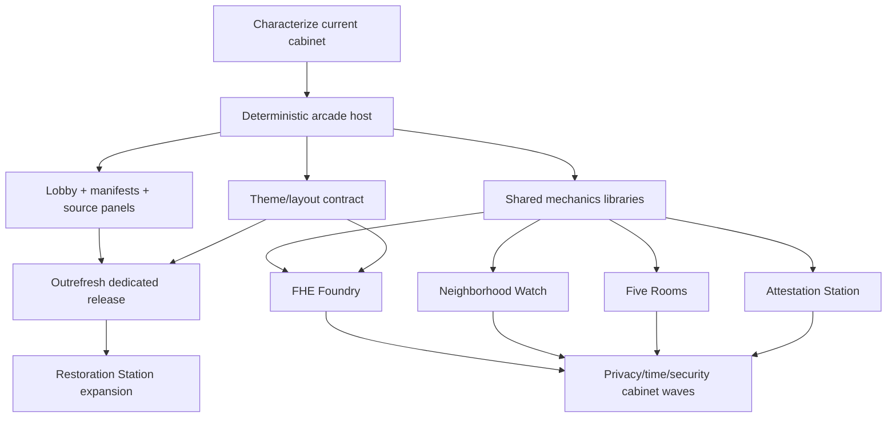

# Cryptography Arcade: Master Product and Implementation Plan

**Status:** Implementation underway - Phases 0-2 and Gates 0-2 complete; Phase 3 in progress  
**Last updated:** 2026-07-12  
**Repository:** `keldefrawy.github.io`  
**Primary audience:** site owner, game designers, implementers, research reviewers, artists, and testers

## Contents

- [Executive decision](#1-executive-decision)
- [Scope and design principles](#2-scope)
- [Information architecture](#4-information-architecture)
- [Technical architecture](#5-technical-architecture)
- [Theme, layout, and narrative system](#6-theme-layout-and-narrative-system)
- [Common delivery phases and testing](#7-common-cabinet-delivery-phases)
- [Migration and release roadmap](#9-platform-migration-from-the-current-cabinet)
- [Mandatory phase and regression-gate ledger](#101-mandatory-phase-and-regression-gate-ledger)
- [Research and security cabinets R00-R19](#11-research-and-security-cabinet-specifications)
- [Cryptography Classics C01-C16](#12-cryptography-classics-specifications)
- [Research incubator](#13-research-incubator-backlog)
- [Source fidelity and asset workflow](#14-source-fidelity-and-editorial-workflow)
- [Release gate and risks](#16-cross-cabinet-release-gate)
- [First implementation backlog](#18-first-implementation-backlog)
- [Decision log, portfolio coverage, and success criteria](#19-decision-log)

## 1. Executive decision

Cryptography Arcade should become a first-class section of the website rather than a second game embedded into the existing homepage dialog. The section should contain three clearly distinguished collections:

1. **Cryptography Classics** - short, generic games that teach foundational cryptographic ideas without claiming to represent a specific paper.
2. **Research Arcade: Karim Eldefrawy and Collaborators** - games whose mechanics are explicitly derived from Karim's papers and whose source, simplifications, assumptions, and limitations are visible in the game.
3. **Security Side Arcade** - adjacent games about networking, systems security, privacy, AI assurance, and optimization that are compelling but are not narrowly cryptographic.

The current **Outrefresh the Mobile Adversary** cabinet becomes the first Research Arcade game. **FHE Foundry** should be the next flagship. **Neighborhood Watch** should be the first smaller follow-on cabinet, and **Attestation Station** should become the first multi-level research campaign.

The same rules must support multiple original presentation bundles: classic retro cabinet, manga/ink, green-code cyberpunk, anime techno-noir, 1990s command-room strategy, alien bio-computer, and a low-distraction academic presentation. These are not separate forks of the games. They are interchangeable visual, layout, narrative, and audio layers over one deterministic simulation.

## 2. Scope

### 2.1 Goals

- Turn research mechanisms into genuinely playable decisions, not decorative animations.
- Make each research cabinet traceable to one or more papers and coauthors.
- Keep toy-model boundaries and threat-model assumptions visible.
- Support two-to-five-minute sessions, deeper challenge modes, and replayable seeded scenarios.
- Separate rules, presentation, input, explanation, and persistence so games remain testable.
- Make every game usable by keyboard, touch, reduced-motion users, and screen-reader users.
- Use themes to broaden aesthetic appeal without changing the game or copying a franchise.
- Keep the production site static and compatible with GitHub Pages/Jekyll.
- Let paper pages link to games through “Play the idea,” and games link back through “Read the research.”

### 2.2 Non-goals for the first public release

- No public global leaderboard or account system.
- No claim that a cabinet is a cryptographic implementation, proof assistant, hardware simulator, or security evaluation unless it actually becomes one.
- No arbitrary user-supplied binaries, biometric data, packet captures, or documents.
- No backend-dependent multiplayer.
- No forced progression gate; learning trails may recommend an order, but every game remains directly accessible.
- No visual theme may alter rules, timing windows, random draws, hit boxes, or scoring.
- No unlicensed characters, logos, music, interface replicas, distinctive glyph streams, or trade dress from *The Matrix*, *Ghost in the Shell*, *Command & Conquer: Red Alert*, or other franchises.

## 3. Design principles

### 3.1 Mechanism before metaphor

Each cabinet starts from a real tension in the source work: privacy versus availability, key exposure versus coding gain, data movement versus accelerator utilization, evidence quality versus bandwidth, or delayed delivery versus forward deletion. The narrative is selected only after the state, actions, invariants, and loss conditions are written.

### 3.2 Epistemic honesty

The player may act only on information available to the role being simulated. A verifier must not see a hidden infection before it receives evidence. An FHE scheduler sees the operation DAG and resource state, not encrypted values. A traffic analyst sees only modeled observations and priors. Hidden state may be revealed after a run as a teaching replay.

### 3.3 One rules engine, many presentations

Game state and scoring must never depend on CSS, sprites, fonts, sound, animation duration, or a theme name. Themes consume semantic state such as `risk`, `unknown`, `ciphertext`, `verified`, or `offline`; game logic never consumes colors such as “red” or “green.”

### 3.4 Determinism before procedural variety

Every run has a versioned seed, rule-set version, difficulty, and action log. Replaying the same seed and actions against the same rule-set version must reproduce the same state snapshots and score. This is required for debugging, tests, shareable challenges, and future research demonstrations.

### 3.5 Progressive disclosure

Every cabinet has four explanation layers:

1. a fifteen-second goal statement;
2. a one-screen rules explanation;
3. a post-run causal replay or battle log;
4. a source-and-limitations drawer for readers who want the paper connection.

### 3.6 Accessibility is a rules requirement

Reaction speed cannot be the only path to success. Time-sensitive games need pause, adjustable speed, and a non-reflex alternative. Canvas visuals require a synchronized semantic summary. Color is always redundant with shape, label, pattern, or icon.

## 4. Information architecture

### 4.1 Proposed routes

| Route | Purpose |
|---|---|
| `/arcade/` | Main lobby, featured cabinet, filters, learning trails, theme preview |
| `/arcade/classics/` | Generic Cryptography Classics catalog |
| `/arcade/research/` | Paper-derived Research Arcade catalog |
| `/arcade/security/` | Security Side Arcade catalog |
| `/arcade/games/<slug>/` | Dedicated game page with stable URL |
| `/arcade/about/` | Methodology, fidelity policy, accessibility, credits, licensing |
| `/arcade/sources/` | Game-to-paper and paper-to-game index |
| `/arcade/accessibility/` | Input modes, timing adaptations, semantic alternatives, known constraints |
| `/arcade/privacy/` | Local saves/settings, clear-data controls, and telemetry policy |
| `/arcade/manifest.json` | Generated machine-readable released/preview catalog |

The homepage should retain a compact **Cryptography Arcade** feature card. It may launch the featured cabinet in a dialog on large screens, but it must also link to the stable game page and the full lobby. A cabinet must never exist only inside a homepage modal.

### 4.2 Lobby zones

- **Featured now:** one production-ready cabinet and one clearly labeled prototype.
- **Cryptography Classics:** foundational games ordered by learning objective.
- **Research Arcade:** games from Karim and collaborators, with paper number, year, coauthors, and source-review status.
- **Security Side Arcade:** network defense, program analysis, quantum optimization, and AI-assurance games.
- **Learning trails:** “Secrets over time,” “Privacy and metadata,” “Proof and verification,” “Encrypted computation,” and “Adversarial networks.”
- **Filters:** category, mechanic, difficulty, expected session length, math depth, input mode, publication year, and release status.

### 4.3 Per-game page anatomy

1. Title, one-sentence player promise, category badge, maturity badge.
2. Start/continue controls, theme selector, difficulty, seed, sound, motion, and text-scale settings.
3. The game surface and semantic live summary.
4. Pause, restart, share-seed, and replay controls.
5. “What just happened?” causal explanation.
6. Rules, controls, accessibility instructions, and scoring.
7. “Based on the research” with full title, all coauthors, venue/status, paper and knowledge-map links.
8. “Toy-model boundary” listing what is represented, abstracted, assumed, or excluded.
9. Credits for design, implementation, art, sound, fonts, and licenses.

### 4.4 Bidirectional research links

Keep the mapping inside the canonical `_data/arcade_games.yml` record rather than editing all 79 paper maps or maintaining a second reverse index:

```yaml
provenance:
  kind: paper-derived
  fidelity: mechanism-faithful
  paper_refs:
    - paper_id: 59
      role: primary_mechanic
      node_ids: [paper-59-architecture-node, paper-59-architecture-memory]
      source_anchor_ids: [anchor-paper-59-architecture]
    - paper_id: 64
      role: campaign_extension
      node_ids: [paper-64-design]
      source_anchor_ids: [anchor-paper-64-architecture]
  review_status: author_review_pending
```

Paper/knowledge-map pages reverse-link by selecting game records whose `paper_refs` contain the current paper ID. Game pages resolve titles, coauthors, venue, status, URLs, knowledge nodes, and source anchors from existing publication/knowledge data. CI must fail if an ID or anchor does not resolve.

## 5. Technical architecture

### 5.1 Target repository structure

```text
arcade.md
arcade/
  about.md
  accessibility.md
  classics.md
  privacy.md
  research.md
  security.md
  sources.md
  manifest.json
_arcade_games/
  outrefresh-mobile-adversary.md
  fhe-foundry.md
  ...
_data/
  arcade_games.yml
  arcade_themes.yml
  arcade_learning_trails.yml
  arcade_topics.yml
_layouts/
  arcade-hub.html
  arcade-game.html
_includes/arcade/
  game-card.html
  game-shell.html
  source-panel.html
  theme-picker.html
  settings-panel.html
assets/css/arcade/
  arcade.scss
  shell.scss
  accessibility.scss
  themes/
assets/js/arcade/
  loader.js
  core/
    game-host.js
    clock.js
    rng.js
    replay.js
    persistence.js
    input.js
    audio.js
    accessibility.js
    theme.js
  mechanics/
    graph.js
    dag.js
    resource-queue.js
    timeline.js
    probability.js
    prefix-tree.js
    policy-expression.js
    transcript.js
  games/
    outrefresh/
    fhe-foundry/
    ...
assets/arcade/
  themes/
  games/
schemas/
  arcade-game.schema.json
  arcade-theme.schema.json
tests/
  unit/
  property/
  fixtures/
  e2e/
  visual/
  content/
.github/workflows/
  arcade-ci.yml
package.json
```

Add an `arcade_games` collection to `_config.yml` with permalink `/arcade/games/:name/`. Add an `arcade-page` body class and wide layout rules rather than reusing `homepage: true`, which currently controls unrelated asset loading and geometry. Production JavaScript should use native ES modules copied directly by Jekyll. Node tooling may be added for development and tests, but GitHub Pages must not require a custom Node build step to serve the site.

### 5.2 Game manifest

Each game record in `_data/arcade_games.yml` should include:

```yaml
schema_version: 1
id: fhe-foundry
slug: fhe-foundry
title: "FHE Foundry: The Noise Never Sleeps"
category: research
status: prototype
size: XL
featured: true
session_minutes: [2, 5]
difficulty_levels: [guided, standard, expert]
mechanics: [dag-scheduling, memory-management, resource-allocation]
renderer: canvas-dom-hybrid
entry_module: /assets/js/arcade/games/fhe-foundry/index.js
default_theme: classic-cabinet
supported_themes: [paper-lab, classic-cabinet]
learning_objectives:
  - FHE acceleration is dominated by both computation and data movement.
limitations:
  - This is a scheduling abstraction, not a cycle-accurate accelerator simulator.
accessibility:
  input_modes: [keyboard, pointer, touch]
  modes: [reduced-motion, relaxed-timing, text-summary]
persistence:
  progress: true
  resumable_runs: true
  save_schema_version: 1
provenance:
  kind: paper-derived
  fidelity: mechanism-faithful
  paper_refs:
    - paper_id: 59
      role: primary_mechanic
    - paper_id: 64
      role: campaign_extension
    - paper_id: 65
      role: caveat_extension
  model_statement: >-
    The game models scheduling and data movement, not exact accelerator timing.
  review_status: author_review_pending
release:
  game_version: 0.1.0
  rules_version: 1
  seed_version: 1
  save_schema_version: 1
```

Required schema validation should reject duplicate IDs, invalid status values, missing modules, missing sources, unsupported themes, or research games without a limitation statement.

### 5.3 Game module contract

Game modules expose a small lifecycle:

```js
export function createGame(options) {
  return {
    initialize(),
    dispatch(action),
    advance(fixedMilliseconds),
    snapshot(),
    serialize(),
    restore(savedState),
    getSemanticSummary(),
    destroy()
  };
}
```

Rules should be implemented as pure reducers where practical:

```js
nextState = reduce(previousState, action, deterministicContext);
```

The renderer subscribes to snapshots. It cannot mutate the model. The host owns pause/resume, visibility pausing, focus management, theme changes, audio preference, persistence, and replay recording.

### 5.4 Deterministic time and randomness

- Use a documented small PRNG with explicit seed state; do not use `Math.random()` inside rules.
- Use a fixed simulation step independent of animation frames.
- Record user actions against simulation time, not wall-clock time.
- Pause must stop simulation time and random draws.
- Cosmetic particles use a separate presentation RNG and never affect gameplay.
- Persist `game_id`, `rules_version`, `seed_version`, seed, difficulty, actions, score, and outcome.
- Reject or migrate incompatible saves rather than silently replaying them under new rules.

### 5.5 Renderer strategy

- **DOM:** controls, forms, HUD, tutorials, source panels, tables, and semantic alternatives.
- **SVG:** graphs, policy trees, small diagrams, and elements that benefit from focusable nodes.
- **Canvas:** dense animation, packet flows, factory lanes, and large timelines.
- **Canvas/DOM hybrid:** preferred for most cabinets; the game remains operable from DOM controls and summarized through accessible DOM state.

### 5.6 Shared mechanics libraries

| Library | First consumers |
|---|---|
| Graph topology and path traversal | Outrefresh, Attestation Station, Neighborhood Watch, Ghost Route, Blindspot, Byzantine Switchboard |
| DAG and dependency scheduler | FHE Foundry, Blindfolded Search, Legacy Crypto Surgeon |
| Resource queues and memory tiers | FHE Foundry, Filter Fall, Clockwork Auction, Quantum Cargo |
| Versioned timeline and event log | Every cabinet |
| Probability and posterior helpers | Blindspot, Five Rooms, Light-Speed Duel, Hallucination Witness |
| Prefix tree | Filter Fall |
| Boolean policy expression | Policy Painter |
| Transcript/commit/challenge abstraction | Five Rooms, Blindfolded Search, Clockwork Auction |
| Grid/range selection | Policy Painter, Key Lattice Relay |

Shared libraries must remain domain-neutral. For example, `graph.js` knows nodes and edges, not “infected devices” or “mix servers.”

### 5.7 Persistence and privacy

Versioned `localStorage` is sufficient for initial preferences, local high scores, tutorial completion, and saved runs:

```text
cryptoArcade:v1:settings
cryptoArcade:v1:progress:<game-id>
cryptoArcade:v1:save:<game-id>:<slot>
```

Save envelope:

```json
{
  "schemaVersion": 1,
  "gameVersion": "1.0.0",
  "rulesVersion": 1,
  "seedVersion": 1,
  "savedAt": "ISO-8601 timestamp",
  "payload": {}
}
```

- Treat stored/imported data as untrusted: validate type, version, size, enum values, lengths, and numeric bounds.
- Catch denied-storage/quota errors and continue in memory.
- Provide “Clear this game” and “Reset all Arcade data.”
- Do not resume real-time runs until deterministic restoration is tested.
- Compare scores only within the same game/rules/difficulty version.
- A checksum may detect accidental damage but must not be described as security.
- Remember the Arcade splash for one session, not on every cabinet launch.

Global settings cover motion, timing/step mode, sound/volume, contrast, text size, input remapping, captions, semantic-summary detail, and autopause. Accessibility preferences override themes.

The site should make no analytics or score-submission request by default. If privacy-preserving aggregate analytics are added later, they require a separate decision, explicit opt-in/opt-out, Global Privacy Control/Do Not Track handling, and a strict allowlist. Never transmit seeds, action histories, save payloads, accessibility preferences, free text, or research-interest profiles. Audit the site’s conditional Google Analytics block before claiming that Arcade routes make no external request.

Public leaderboards are deferred. Client-only games are trivially modifiable, and a leaderboard would introduce identity, abuse, anti-cheat, moderation, and data-retention work unrelated to the first goal.

## 6. Theme, layout, and narrative system

### 6.1 Separate the axes

A “skin” is actually three independently testable layers:

1. **Visual theme:** color, typography, border, texture, icon, sprite, particle, and lighting tokens.
2. **Layout preset:** cabinet, comic panels, mission console, command table, immersive widescreen, or paper-lab arrangement.
3. **Narrative/audio pack:** terminology, announcer voice, background story, ambient loops, and semantic sound palette.

The implementation should keep these axes separate, but the product should ship curated bundles rather than exposing every combinatorial pairing. This prevents an untestable theme × layout × narrative explosion.

Conceptually a mounted cabinet is:

```text
gameId + layoutId + themeId + narrativeId + accessibilityProfile
```

Only `gameId`, model/rules version, seed, difficulty, and actions belong in a replay. A replay must open under a different compatible presentation bundle with the same state sequence and score. Theme/layout compatibility is explicitly whitelisted; a theme may recommend a layout but cannot secretly contain game logic or board geometry.

Narrative manifests contain strings, glossary aliases, locale/reading-level metadata, announcer copy, and story credits. A narrative alias must retain the canonical term on first use—for example, “fresh dispatch serial (**nonce**)” or “sealed payload (**ciphertext**)”. The canonical rules and source panels never disappear behind fiction.

### 6.2 Initial original theme bundles

| ID | Display name | Direction | Layout | Audio |
|---|---|---|---|---|
| `paper-lab` | Paper Lab | High-legibility research notebook, diagrams, restrained color | clean lab | optional subtle clicks |
| `classic-cabinet` | Classic Cabinet | Existing monochrome/pixel/CRT lineage, scanlines, chunky controls | arcade cabinet | original chiptune/percussion |
| `ink-circuit` | Ink Circuit | Original manga composition, halftone, speed lines, black/white plus one spot color | comic panels | paper snaps, brush hits, synth accents |
| `neon-terminal` | Neon Terminal | Original green-code cyberpunk terminal with abstract glyph flow | mission console | modem pulses and low synth |
| `techno-noir-city` | Techno-Noir City | Original anime-inspired urban HUD, rain, holographic layers, muted neon | cinematic widescreen | atmospheric electronic score |
| `command-grid` | Command Grid | 1990s command-room strategy energy, radar, unit cards, industrial labels | command table | radio clicks and original martial-electronic cues |
| `xenocrypt` | Xenocrypt | Alien bio-circuitry, unknown signals, organic panels, cosmic depth | immersive organism-console | resonant pulses and nonverbal tones |

`paper-lab` is the reference and fallback theme. Every game must ship in `paper-lab` and `classic-cabinet`; other bundles may be added after the game passes its fidelity and accessibility gates.

### 6.3 Semantic tokens

Themes implement semantic CSS custom properties rather than game-specific colors:

```css
[data-arcade-theme] {
  --arcade-bg: ...;
  --arcade-surface: ...;
  --arcade-ink: ...;
  --arcade-muted: ...;
  --arcade-focus: ...;
  --arcade-safe: ...;
  --arcade-warning: ...;
  --arcade-danger: ...;
  --arcade-unknown: ...;
  --arcade-ciphertext: ...;
  --arcade-public-data: ...;
  --arcade-secret-data: ...;
  --arcade-authenticated: ...;
  --arcade-tampered: ...;
  --arcade-fresh: ...;
  --arcade-replayed: ...;
  --arcade-verified: ...;
  --arcade-offline: ...;
  --arcade-grid: ...;
  --arcade-shadow: ...;
  --arcade-radius: ...;
  --arcade-motion-fast: ...;
}
```

Canvas renderers receive a resolved immutable `ThemeView` containing the same semantic roles. SVG should prefer `currentColor` and classes. A theme switch pauses the host, replaces presentation assets, rerenders the same snapshot, and resumes without advancing time or consuming randomness.

Game-specific CSS aliases semantic roles rather than creating unexplained raw colors—for example, `--game-compromised: var(--arcade-danger)`. The theme contract also covers action states, typography, geometry, effects, and motion values. Semantic audio mappings live in the audio manifest, not CSS.

### 6.4 Accessibility profiles are not themes

High contrast, reduced motion, reduced transparency, large text, dyslexia-friendly font choice, color-vision-safe patterns, captions, and sound-off are user profiles that override any theme. A theme cannot opt out of them.

Required rules:

- WCAG 2.2 AA contrast for essential text and controls.
- No status communicated by color alone.
- Visible focus in every theme.
- Reduced motion removes parallax, flashing, shaking, rapid zoom, and nonessential particles.
- `prefers-reduced-motion` is honored before stored settings load.
- Audio never autoplays; every semantic sound has a visual/text equivalent.
- Touch targets remain at least 44 × 44 CSS pixels.
- Layout changes preserve heading order, reading order, labels, and control names.

### 6.5 Theme manifests and licensing

Each theme manifest records its token file, layout preset, asset pack, audio pack, font stack, author, license, attribution, and review status. CI should reject unlicensed assets. Shipped theme names and copy must remain original; franchise names may appear only in internal planning context explaining the requested mood, never as product branding.

### 6.6 Theme testing strategy

Testing every game in every theme at every viewport is unnecessarily large. Use this matrix:

- Every game: `paper-lab` and `classic-cabinet`, mobile and desktop.
- Reference games Outrefresh, FHE Foundry, and Policy Painter: every theme bundle, mobile/tablet/desktop.
- Every additional theme/game pairing: pairwise sampled visual tests.
- Every theme: token completeness, contrast audit, reduced-motion audit, keyboard focus, missing-asset fallback, and no-layout-overflow checks.
- Theme-switch E2E test: state, score, clock, seed, and action log remain byte-for-byte unchanged.

Create a **theme specimen gallery** before art-heavy bundles. It renders every token, control state, semantic crypto state, long label, error, empty/loading view, and idle/running/paused/warning/win/loss state. Test the gallery in normal, reduced-motion, forced-colors, and high-contrast modes. Working theme/bundle names also receive a lightweight trademark/name-clearance review before release.

### 6.7 Theme implementation waves

| Wave | Bundle | Implementation focus | Unique acceptance tests |
|---|---|---|---|
| T0 | Theme contract + specimen gallery | JSON schema, semantic tokens, layout slots, narrative glossary, asset licenses | Missing token/asset/license fails; replay hash identical before/after switch |
| T1 | Paper Lab | Correctness/reference layout, system/OFL fonts, static diagrams, no decorative dependency | 320 px and 400% zoom linearize; forced colors and high contrast remain usable; audio/effects off by default |
| T2 | Classic Cabinet | Extract current cabinet chrome, pixel/CRT effects, original synthesized cues | Reduced motion removes scanlines/flicker/shake; cabinet geometry does not shrink touch targets; no startup replay every game |
| T3 | Neon Terminal | Abstract circuit/glyph motion, console layout, phosphor semantic palette | No falling-character franchise imitation; danger/unknown/safe distinguishable without green hue; effects-off is static |
| T4 | Ink Circuit | Original ink/halftone assets, ordered comic panels, spot-color semantics | DOM/focus/reading order matches panel order; speed lines removed under reduced motion; 200% text does not cross panels |
| T5 | Command Grid | Original fictional maps/symbols, command-table layout, radio-style cues | No real/familiar faction insignia or copied RTS chrome; map has table/list alternative; cues have persistent captions |
| T6 | Techno-Noir City | Original city/HUD art, cel-like layers, widescreen layout | Parallax/rain/lens effects all disable; narrow view falls back to Clean Lab order; no recognizable franchise silhouettes/UI |
| T7 | Xenocrypt | Original bio-circuit textures/glyphs, organic console, nonverbal audio | No jump scares; pulsing/breathing freezes; asymmetric layout preserves source/focus order; unknown glyphs never replace canonical terms |

Each wave first passes on the specimen gallery, then Outrefresh, FHE Foundry, and Policy Painter (canvas-heavy, scheduler-heavy, and grid/text-heavy references), then receives pairwise smoke coverage across the rest of the catalog.

## 7. Common cabinet delivery phases

Every game follows the same gates.

### Phase A - Research and rules contract

- Identify source papers, coauthors, status, and full-text availability.
- Write the player role, observable state, hidden state, actions, transition rules, score, failure conditions, assumptions, and exclusions.
- Mark invented game balancing separately from paper-derived behavior.
- Create at least three small hand-audited scenarios with expected outcomes.
- Obtain author review before using exact numerical claims as game facts.

**Exit:** a versioned rules document and fixtures exist; every rule has a source, an explicit abstraction, or an “invented for play” label.

### Phase B - Deterministic model kernel

- Implement pure state transitions and seeded scenario generation without presentation.
- Add unit, invariant, property, and deterministic replay tests.
- Generate semantic summaries from state.
- Add serialization/version migration strategy.

**Exit:** 1,000 generated runs complete without invariant violations; identical seed/actions reproduce identical snapshots.

### Phase C - Playable vertical slice

- Implement one level, one difficulty, `paper-lab`, keyboard, pointer, and touch input.
- Add tutorial, pause, reset, replay, and causal end-of-run explanation.
- Measure performance and bundle size.

**Exit:** a new player can complete a run without reading the paper; the game remains playable at 360 px width and 200% text zoom.

### Phase D - Fidelity, accessibility, and content review

- Review terminology, scoring incentives, threat model, and limitations.
- Add screen-reader summary, non-reflex mode where needed, reduced motion, captions, and no-color-only encoding.
- Add paper/coauthor credits and source links.
- Run keyboard-only, axe, browser, and assistive-technology checks.

**Exit:** no critical accessibility issue; author/content review recorded; toy-model boundary visible before and after play.

### Phase E - Expansion, themes, and release

- Add difficulty levels, procedural scenarios, local achievements, and learning-trail links.
- Add `classic-cabinet`, then selected additional themes.
- Add visual regression, performance budgets, production smoke test, and rollback notes.

**Exit:** release checklist passes and the game is marked `released` in the manifest.

## 8. Testing and quality strategy

### 8.1 Tooling to introduce

- **Vitest** for pure JavaScript unit and fixture tests.
- **fast-check** for state-machine and property-based testing.
- **Playwright** for browser, touch, keyboard, pause/resume, persistence, and screenshot tests.
- **axe-core/Playwright** for automated accessibility checks.
- **Ajv or equivalent** for game/theme/link manifest schema validation.
- **Jekyll build** as a required production integration check.
- Optional HTML/link checker after the local Jekyll build.

Node is a development/test dependency only. Production remains static.

### 8.2 Test layers

| Layer | What it protects |
|---|---|
| Unit | reducers, scoring, data structures, policy evaluation, queue behavior |
| Fixture | hand-audited source-derived examples and boundary cases |
| Property | invariants over many seeds and action sequences |
| Differential | optimized model versus slow reference model on small inputs |
| Replay | deterministic seed/action reproduction and save compatibility |
| Integration | host lifecycle, theme switching, persistence, routing, source panels |
| E2E | tutorial-to-outcome paths on keyboard, pointer, and touch |
| Accessibility | semantics, focus, contrast, zoom, reduced motion, canvas alternative |
| Visual | clipping, overlap, missing assets, theme regressions |
| Content/fidelity | claims, paper IDs, coauthors, status, limitations, broken links |
| Performance | lazy loading, frame time, memory cleanup, asset and module budgets |

### 8.3 Platform-wide invariant suite

- Theme or layout changes never change game state, score, clock, RNG, or action log.
- Pausing or hiding the page never advances simulation.
- Destroying a game removes observers, animation frames, timers, audio nodes, and listeners.
- Same rules version + seed + difficulty + actions yields the same final hash.
- Invalid or newer save versions fail safely with a readable message.
- Controls remain reachable and named at 200% zoom and 320 CSS-pixel width.
- A run can be completed without sound, fine pointer accuracy, or color discrimination.
- Lobby and game explanations remain usable without JavaScript.
- Only the selected game module and selected theme assets load.
- No game performs an external network request during play.

### 8.4 Initial performance budgets

Treat these as targets to confirm after measuring the current baseline:

- Lobby JavaScript: no more than 50 KB compressed.
- Shared host/core loaded by a game: no more than 80 KB compressed.
- Initial per-game JavaScript: no more than 150 KB compressed; advanced modes may lazy-load more.
- Initial selected-theme assets: no more than 500 KB compressed; audio loads only after opt-in.
- Active simulation/render work: average below 8 ms per frame on a representative midrange mobile device.
- Game destroy/reopen loop: no sustained heap growth across ten cycles.
- Largest contentful paint on the arcade lobby: target under 2.5 seconds on a measured mobile profile.

### 8.5 CI stages

1. YAML/JSON schema and source-link validation.
2. JavaScript lint and formatting check.
3. Unit, fixture, property, and replay tests.
4. Jekyll production build.
5. Chromium desktop/mobile E2E plus axe on every pull request.
6. Firefox/WebKit and full screenshot matrix nightly or before release.
7. Performance and broken-link report before changing a game to `released`.

### 8.6 Human playtesting

Automation cannot establish that a cryptographic idea became understandable or that a metaphor teaches the right lesson. Each cabinet needs three small review groups before publication:

- **Novice playtest:** Can a visitor state the goal within fifteen seconds, complete the tutorial without coaching, and explain the primary tradeoff afterward?
- **Domain review:** Can a cryptographer or security researcher identify any false implication, missing assumption, misleading score, or role-visibility violation?
- **Accessibility review:** Can keyboard-only and screen-reader users complete the same learning objective, and does relaxed/step mode preserve it?

Record observed confusion separately from player failure. If skilled play consistently rewards behavior that contradicts the source lesson, revise the rules rather than merely rewriting the tutorial. Theme preference tests should compare comprehension and usability, not alter scoring or difficulty.

## 9. Platform migration from the current cabinet

The current implementation is a valuable working prototype but is monolithic: approximately 1,557 lines of JavaScript, 1,006 lines of SCSS, and 250 lines of include markup. Refactor it incrementally.

### M0 - Characterize before moving

- Record current opening/closing, splash, focus restoration, scheduling, forecast, pause, reset, loss, history, reduced-motion, and visibility behavior in Playwright tests.
- Capture reference screenshots at mobile and desktop widths.
- Document current 4-of-7 rules and hybrid-model disclaimer.

### M1 - Extract shared shell

- Move dialog/splash/settings/history/source-panel behavior into reusable arcade includes and host modules.
- Preserve current homepage behavior during migration.
- Extract semantic CSS tokens without changing the rendered result.

### M2 - Extract deterministic Outrefresh model

- Move topology, attacker movement, recovery, epochs, exposure, quorum, score, and event scheduling into a pure module.
- Replace internal random seeds with injected, shareable seeds.
- Add snapshot/action-log replay.

### M3 - Create dedicated game page and lobby

- Add the game manifest and `_arcade_games` collection.
- Publish `/arcade/games/outrefresh-mobile-adversary/`.
- Replace the homepage-only launch with featured-card + stable-page fallback.

### M4 - Introduce themes

- Make the current appearance `classic-cabinet`.
- Add `paper-lab` as the accessibility/reference theme.
- Verify switching themes does not alter a run.

### M5 - Retire legacy paths

- Remove duplicated host logic only after behavior, replay, accessibility, and screenshot equivalence pass.
- Keep the old homepage anchor working as a redirect or launch alias for at least one release.

## 10. Delivery roadmap

### 10.1 Mandatory phase and regression-gate ledger

This table is the canonical execution status. Update it when a phase starts, when implementation stops, when its `.5` gate starts, and when that gate finishes. A later integer phase **must not start** until the preceding `.5` gate is green.

**Traffic-light status**

- 🔴 **Incomplete** - not started or gate not satisfied.
- 🟠 **In progress** - actively being implemented or tested.
- 🟢 **Complete** - deliverables finished and evidence recorded; for `.5` rows, every new and prior regression check passed.

Dates use ISO 8601 with timezone. “Model used” records the model that performed the implementation or gate work; change it whenever responsibility changes. A dash means not yet started.

| Phase | Deliverable or mandatory gate | New-check target | Required accumulated regression | Status | Started | Ended | Model used | Notes / evidence |
|---:|---|---:|---|---|---|---|---|---|
| 0.0 | Baseline and test foundation: inventory current game, add test tooling, capture behavior contracts, establish report format | Implementation phase | Existing Jekyll build and current-game smoke baseline | 🟢 Complete | 2026-07-12T13:13:00-07:00 | 2026-07-12T13:30:31-07:00 | GPT-5 (Codex) | Added the Node/Playwright/Vitest harness, strict Jekyll publication boundary, 104-check Gate 0 matrix, cumulative gate runner, JUnit/JSON/Markdown evidence format, and current-game behavior contracts. |
| 0.5 | **Gate 0:** current-site characterization, unit/static contracts, Jekyll integration, browser smoke, accessibility, and visual baselines | 96-120 | All Gate 0 cases | 🟢 Complete | 2026-07-12T13:30:31-07:00 | 2026-07-12T13:38:01-07:00 | GPT-5 (Codex) | **104/104 distinct checks passed:** 70/70 unit, contract, and Jekyll checks; 68/68 desktop/mobile browser executions across 34 scenarios; zero failed, flaky, or skipped. Axe testing drove a marquee contrast fix. Evidence: `test-results/arcade/phase-0.5/summary.{json,md}` and JUnit/browser artifacts. |
| 1.0 | Arcade Jekyll collection, registry/schema, canonical routes, lobby zones, provenance skeleton, no-JS pages | Implementation phase | Gate 0 remains green | 🟢 Complete | 2026-07-12T13:39:04-07:00 | 2026-07-12T13:51:49-07:00 | GPT-5 (Codex) | Added a strict 36-game registry/schema, 36 canonical collection routes, lobby/category/source/privacy/accessibility/about/manifest routes, Paper Lab catalog styling, homepage entry point, game-to-paper panels, paper-to-game reverse links, and a no-JS-readable surface. Registry validation and strict Jekyll build pass; no game-logic refactor. |
| 1.5 | **Gate 1:** registry/schema/content/link/build/route tests plus direct-page/no-JS browser paths | 96-120 | Gates 0-1, including every prior case | 🟢 Complete | 2026-07-12T13:51:49-07:00 | 2026-07-12T14:05:47-07:00 | GPT-5 (Codex) | **96/96 new and 200/200 cumulative distinct checks passed:** 142/142 unit/contract/integration checks and 116/116 desktop/mobile browser executions across 58 scenarios; zero failed, flaky, or skipped. Covers 36 routes, 62 bidirectional paper links, invalid registries, no-JS paths, axe, privacy, keyboard, responsive geometry, and visual artifacts. Evidence: `test-results/arcade/phase-1.5/summary.{json,md}` plus JUnit/category/browser/screenshot artifacts. |
| 2.0 | Deterministic host, clock, RNG, action log, replay/save envelope; extract Outrefresh model and dedicated page | Implementation phase | Gates 0-1 remain green | 🟢 Complete | 2026-07-12T14:06:47-07:00 | 2026-07-12T14:37:19-07:00 | GPT-5 (Codex) | Shipped deterministic named RNG streams, explicit clock, monotonic action log, compatible replay, checksummed versioned saves, local persistence, fixed-step lifecycle host, pure 4-of-7 Outrefresh model, and an accessible dedicated page with step/replay/import/export, SVG + text state, two loss meters, and bounded history. Homepage prototype remains intact. Transactional import validation preserves the current run when corrupt data is rejected. |
| 2.5 | **Gate 2:** Outrefresh unit/property/differential/replay/lifecycle/browser gameplay regression | 96-120 | Gates 0-2, including legacy modal compatibility | 🟢 Complete | 2026-07-12T14:37:19-07:00 | 2026-07-12T14:38:22-07:00 | GPT-5 (Codex) | **104/104 new and 304/304 cumulative distinct checks passed:** 222/222 unit/contract/integration checks; 164/164 desktop/mobile browser executions across 82 scenarios; exactly 1,000 generated model runs; zero failed, flaky, or skipped. The gate exposed and drove a transactional-import fix so corrupted saves cannot replace an active run. Evidence: `test-results/arcade/phase-2.5/summary.{json,md}` plus JUnit/category/browser/screenshot artifacts. |
| 3.0 | Theme/layout/narrative contracts; Paper Lab and Classic Cabinet; shared accessibility/settings/audio shell | Implementation phase | Gates 0-2 remain green | 🟠 In progress | 2026-07-12T14:38:42-07:00 | — | GPT-5 (Codex) | Started only after Gate 2 passed. Implement the first two original themes and versioned local accessibility/presentation settings without allowing theme, motion, contrast, text, timing, or audio preferences to enter rules, replay, RNG, score, or save state. |
| 3.5 | **Gate 3:** token/schema/contrast/focus/motion/theme-switch/state-hash/responsive regression | 96-120 | Gates 0-3 | 🔴 Incomplete | — | — | — | Include specimen gallery, forced-colors, 320 px, and 400% zoom. |
| 4.0 | Generic platform pilots: Seal & Reveal and Merkle Mountain | Implementation phase | Gates 0-3 remain green | 🔴 Incomplete | — | — | — | Validates transcript and SVG/tree mechanics without changing host. |
| 4.5 | **Gate 4:** Classic-game unit/property/E2E/a11y/replay/visual tests and all earlier regressions | 96-120 | Gates 0-4 | 🔴 Incomplete | — | — | — | Both pilots must run under Paper Lab and Classic Cabinet. |
| 5.0 | FHE Foundry vertical slice: F1 Sprint, CraterLake Endurance, reference scheduler, causal debrief | Implementation phase | Gates 0-4 remain green | 🔴 Incomplete | — | — | — | Next flagship; no plaintext in model. |
| 5.5 | **Gate 5:** DAG/memory/noise/bootstrap/reference-schedule/browser/gameplay/performance regression | 96-120 | Gates 0-5 | 🔴 Incomplete | — | — | — | Include exact tiny oracle and schedule determinism. |
| 6.0 | Neighborhood Watch and Five Rooms, One Witness | Implementation phase | Gates 0-5 remain green | 🔴 Incomplete | — | — | — | Validates graph optimizer and commit-challenge engines. |
| 6.5 | **Gate 6:** coding/key exposure and ZK transcript/property/E2E/a11y regression | 96-120 | Gates 0-6 | 🔴 Incomplete | — | — | — | Compare small network cases with brute-force optimum. |
| 7.0 | Attestation Station campaign core: single device, swarm alpha/s, safety window, evidence types | Implementation phase | Gates 0-6 remain green | 🔴 Incomplete | — | — | — | Unknown evidence must never become “infected.” |
| 7.5 | **Gate 7:** topology/evidence/freshness/safety/remediation/browser campaign regression | 96-120 | Gates 0-7 | 🔴 Incomplete | — | — | — | Include hidden-trace replay and service-separation checks. |
| 8.0 | Privacy wing I: Blindspot and Ghost Board | Implementation phase | Gates 0-7 remain green | 🔴 Incomplete | — | — | — | Exact posterior before MCMC; explicit server views/leakage. |
| 8.5 | **Gate 8:** posterior/PIR/role-view/leakage/probabilistic/E2E regression | 96-120 | Gates 0-8 | 🔴 Incomplete | — | — | — | Approximate results must match exact tiny fixtures within tolerance. |
| 9.0 | Privacy/time wing II: Key Lattice Relay, Clockwork Auction, Ghost Route | Implementation phase | Gates 0-8 remain green | 🔴 Incomplete | — | — | — | Keep static-group and source-limited modes labeled. |
| 9.5 | **Gate 9:** causal lattice/deadline/composition/routing/visibility/browser regression | 96-120 | Gates 0-9 | 🔴 Incomplete | — | — | — | Never impose false total order or omit composition loss. |
| 10.0 | Security wing I: Filter Fall and Byzantine Switchboard | Implementation phase | Gates 0-9 remain green | 🔴 Incomplete | — | — | — | Brute-force/DP oracle and safety/liveness separation. |
| 10.5 | **Gate 10:** filtering optimum/quorum/fault-ordering/full gameplay regression | 96-120 | Gates 0-10 | 🔴 Incomplete | — | — | — | Generated small cases must match reference algorithms. |
| 11.0 | Research wing III: Blindfolded Search and Restoration Station | Implementation phase | Gates 0-10 remain green | 🔴 Incomplete | — | — | — | Role visibility and recovery prerequisites are central. |
| 11.5 | **Gate 11:** pattern oracle/transcript/FSM/convergence/leakage/browser regression | 96-120 | Gates 0-11 | 🔴 Incomplete | — | — | — | No “secure” state before every declared prerequisite. |
| 12.0 | Systems/identity wing: Legacy Crypto Surgeon, Reusable Vault, Policy Painter | Implementation phase | Gates 0-11 remain green | 🔴 Incomplete | — | — | — | Synthetic fixtures only; no real binaries/biometrics/documents. |
| 12.5 | **Gate 12:** dataflow/reuse/policy/privacy/E2E/accessibility regression | 96-120 | Gates 0-12 | 🔴 Incomplete | — | — | — | Exhaustive small policy/threshold oracles required. |
| 13.0 | Experimental wing: Light-Speed Duel, Quantum Cargo Mixer, Hallucination Witness | Implementation phase | Gates 0-12 remain green | 🔴 Incomplete | — | — | — | Preview-only until source/fidelity conditions pass. |
| 13.5 | **Gate 13:** statistical/timing/distribution/calibration/browser regression | 96-120 | Gates 0-13 | 🔴 Incomplete | — | — | — | Fixed seeds, declared confidence intervals, no physical/quantum overclaim. |
| 14.0 | Complete remaining Classics and selectively promote audited incubator cabinets | Implementation phase | Gates 0-13 remain green | 🔴 Incomplete | — | — | — | Promotion requires its own rules contract and fixtures. |
| 14.5 | **Gate 14:** full Classics/incubator correctness, learning-trail, content, gameplay regression | 96-120 | Gates 0-14 | 🔴 Incomplete | — | — | — | Validate category/provenance distinctions. |
| 15.0 | Full presentation wave: Ink Circuit, Neon Terminal, Techno-Noir City, Command Grid, Xenocrypt | Implementation phase | Gates 0-14 remain green | 🔴 Incomplete | — | — | — | Original/licensed asset manifests required. |
| 15.5 | **Gate 15:** every-skin token/asset/license/contrast/motion/layout/state-equivalence regression | 96-120 | Gates 0-15 | 🔴 Incomplete | — | — | — | Every game in canonical + Paper Lab; pairwise all-skin matrix. |
| 16.0 | Whole-arcade browser and end-to-end gameplay hardening | Implementation phase | Gates 0-15 remain green | 🔴 Incomplete | — | — | — | Direct URLs, saves, reloads, back/forward, orientation, touch, keyboard. |
| 16.5 | **Gate 16:** full browser matrix and end-to-end win/loss/replay paths | 96-120 | Gates 0-16 | 🔴 Incomplete | — | — | — | Chromium/Firefox/WebKit plus representative real mobile checks. |
| 17.0 | Visual-appeal, responsive polish, animation/audio balance, all-skin art-direction review | Implementation phase | Gates 0-16 remain green | 🔴 Incomplete | — | — | — | No rules changes without returning to the relevant gate. |
| 17.5 | **Gate 17:** visual-regression, screenshot-state, theme/layout, zoom, color-vision, motion/audio regression | 96-120 | Gates 0-17 | 🔴 Incomplete | — | — | — | Idle/tutorial/running/paused/warning/win/loss/error states. |
| 18.0 | Release candidate: source/author review, accessibility/performance/privacy, documentation, rollback | Implementation phase | Gates 0-17 remain green | 🔴 Incomplete | — | — | — | Freeze rules; only release-blocking fixes. |
| 18.5 | **Final gate:** complete accumulated regression, browser gameplay, visual/skin, provenance, performance and production smoke | 120+ final checks plus audits | **Every Gate 0-18 and every retained test** | 🔴 Incomplete | — | — | — | Release only with zero blocking failures and evidence archive. |

#### Mandatory `.5` gate composition

Each `.5` gate adds approximately 96-120 **meaningful new or changed checks**, not duplicated assertions created only to increase a count, and reruns every retained prior check. Unless a phase justifies a different distribution, target:

- 30-40 unit, invariant, property, or differential cases;
- 12-20 schema, content, source, and static-contract cases;
- 18-25 integration, Jekyll-build, persistence, lifecycle, and replay cases;
- 20-30 browser E2E, keyboard/touch, accessibility, and gameplay cases;
- 10-20 visual, responsive, theme, performance, and manual-review cases.

At least one success, expected failure, boundary case, invalid-input case, save/replay case, keyboard path, narrow viewport, and reduced-motion/semantic-summary path must exist for every newly introduced cabinet or platform capability. Removing or weakening a prior check requires a written reason in the gate evidence.

Each gate writes a machine-readable and human-readable evidence bundle:

```text
test-results/arcade/phase-X.5/
  summary.json
  summary.md
  junit/
  browser/
  screenshots/
  accessibility/
  performance/
```

`summary.json` records planned/collected/passed/failed/skipped counts by category, all commands/suites, rules/seed/save versions, browsers/viewports, start/end times, model used, Jekyll build identity, failures/retries, and prior gates rerun. Generated test evidence should be CI artifacts or ignored local output, not committed screenshots/reports unless selected as stable baselines.

### 10.2 Release waves

| Wave | Public result | Main work | Exit condition |
|---|---|---|---|
| `0.0` | Internal foundation | Characterization tests, manifests, deterministic host, theme tokens | Current cabinet replays deterministically without visual regression |
| `0.1` | Arcade lobby beta | Dedicated Outrefresh page, lobby zones, Paper Lab + Classic Cabinet | Stable routes, source panels, keyboard/mobile release gate |
| `0.2` | First new cabinet | FHE Foundry vertical slice; two generic onboarding games | One complete F1 Sprint, one CraterLake level, shareable seeds |
| `0.3` | Small-cabinet pack | Neighborhood Watch and Five Rooms | Reusable graph/transcript mechanics validated by two games |
| `0.4` | First campaign | Attestation Station levels 1-3 | Measurement, swarm aggregation, and uncertainty are distinct |
| `0.5` | Privacy and time wing | Blindspot, Ghost Board, Key Lattice, Clockwork Auction prototypes | Each passes author/source fidelity review |
| `0.6` | Security Side Arcade | Filter Fall, Legacy Crypto Surgeon, Byzantine Switchboard | Security category and category filters are mature |
| `0.7` | Full presentation packs | Ink Circuit, Neon Terminal, Techno-Noir City, Command Grid, Xenocrypt | Theme reference matrix and licensing gate pass |
| `1.0` | Coherent public arcade | At least eight released cabinets, four classics, seven presentation bundles | Cross-game learning trails and release gates pass |

### 10.3 Dependency flow



### 10.4 Priority and size

| ID | Cabinet | Category | Priority | Relative size | Main reusable dependency |
|---|---|---|---|---|---|
| R00 | Outrefresh the Mobile Adversary | Research | P0 | L refactor | host, graph, timeline, replay |
| R01 | FHE Foundry | Research | P1 | XL | DAG, queues, memory tiers |
| R02 | Attestation Station | Research | P1 | XL campaign | graph, hidden state, evidence |
| R03 | Neighborhood Watch | Research | P1 | M | graph, rank/flow, optimizer oracle |
| R04 | Five Rooms, One Witness | Research | P1 | M | transcript, commit/challenge |
| R05 | Blindspot | Research | P2 | L | graph, probability, exact oracle |
| R06 | Ghost Board | Research | P2 | L | role views, transcript, timeline |
| R07 | Key Lattice Relay | Research | P2 | L | grid/lattice, causal timeline |
| R08 | Clockwork Auction | Research | P2 | L | resource/time composition |
| R09 | Ghost Route | Research | P2 | L | mobile graph, visibility masks |
| R10 | Filter Fall | Security | P1 | S/M | prefix tree, resource allocation |
| R11 | Blindfolded Search | Research | P2 | L | transcript, matrices, role views |
| R12 | Restoration Station | Research | P2 | L expansion | Outrefresh engine, FSM |
| R13 | Light-Speed Duel | Research | P3 | M | seeded trials, timeline |
| R14 | Legacy Crypto Surgeon | Security | P2 | L | DAG, dataflow, fixture oracle |
| R15 | Reusable Vault | Research | P3 | L | distance, leakage ledger, thresholds |
| R16 | Byzantine Switchboard | Security/Research | P2 | L | graph, quorum, event log |
| R17 | Policy Painter | Research | P2 | M | grid, Boolean policy AST |
| R18 | Quantum Cargo Mixer | Security/Algorithms | P3 | M/L | probability, optimization |
| R19 | Hallucination Witness | Experimental | P4 | M | calibration, evidence states |

Relative size is a planning aid, not a calendar commitment. No XL game should block shipping an independent S/M cabinet.

## 11. Research and security cabinet specifications

Each specification below inherits the common Phase A-E gates. “Tests” lists the game-specific cases in addition to the platform-wide suite.

### R00 - Outrefresh the Mobile Adversary

**Sources:** papers #25, #28, #31/#32, #44/#45, #52, #55, and #61. Current implementation: `_includes/home-adversary-game.html`, `assets/js/adversary-game.js`, and `assets/css/adversary-game.scss`.

**Player promise:** Commit a randomized rejuvenation policy for a toy 4-of-7 proactive network before the mobile adversary’s path is known. Refresh too slowly and four compatible shares are exposed; recover too aggressively and the live quorum disappears.

**Model and actions:** State includes epoch, seven node states, current-epoch exposure set, attacker route, recovery intervals, committed cadence/batch, and online quorum. The player selects cadence and batch before starting, then may pause, inspect history, replay, or reset. Not reacting to the visible attacker is deliberate: the path is a replay aid, not defender information.

**Score and terminal conditions:** Score survival, clean refreshes, and useful online-party time. Privacy fails at four compatible current-epoch exposures. Availability fails below four online parties. These are separate outcomes and must never be merged into one health bar.

**Implementation phases:**

- **A:** Freeze the existing toy rules and label which behavior is proactive-share abstraction versus randomized recovery invention.
- **B:** Extract topology, event ordering, attack, recovery, refresh, score, and terminal logic into a seeded pure model. Make simultaneous boundary events explicit.
- **C:** Add shareable seed, deterministic replay, authored presets, and separate privacy/availability meters on a dedicated game page.
- **D:** Add tabular replay, exact source links, keyboard-complete setup, and throttled semantic announcements.
- **E:** Convert current appearance to `classic-cabinet`; add `paper-lab`; later add dynamic-group challenges without bloating the default mode.

**Unique tests:** `safe_refresh_7x4`, `exposure_on_fourth_visit`, `quorum_collapse_batch4`, `refresh_and_attack_same_tick`, `recovery_reentry`, and `identical_seed_identical_log`. Properties: old/new epoch shares never combine; online count remains 0-7; attacker traverses only legal edges; terminal states are absorbing.

**Fidelity gate:** The cabinet remains labeled an illustrative hybrid, not a protocol simulator. Recovery does not erase a secret merely by taking parties offline; quorum loss is availability failure.

**Definition of done:** Same seed/actions replay byte-for-byte; both loss modes receive distinct causal explanations; no renderer state affects simulation; mouse, keyboard, reduced-motion, and screen-reader paths complete.

### R01 - FHE Foundry: The Noise Never Sleeps

**Sources:** [F1 #59](../pubs/2021/f1-fhe-accelerator-extended.pdf), [CraterLake #64](../pubs/2022/craterlake-isca2022.pdf), and scheme-switching barriers #65.

**Player promise:** Operate a factory that computes on sealed ciphertexts. Schedule a branch-free operation DAG across specialized units while keeping enormous operands and reusable key hints close enough to compute to avoid stalls.

**Model and actions:** Ciphertext jobs carry abstract level/noise, size, location, and dependencies. Resources include NTT, automorphism, modular multiply/add, key-switch and load/store units, register/scratchpad capacity, key hints, cycle reservations, and an off-chip queue. Actions dispatch a ready operation, prefetch/evict data or hints, select a supported variant, and schedule bootstrapping before the modeled budget is exhausted.

**Modes:**

1. **F1 Sprint:** bounded-depth workloads; win through static scheduling, pipelining, and reuse.
2. **CraterLake Endurance:** deep workloads; boosted key switching, key-hint generation, and costly bootstrapping enable continued computation.
3. **Hardness Wall:** a later #65 challenge showing that broad exact/approximate scheme switching is not a free converter.

**Score and terminal conditions:** Reward completed workloads, modeled cycles, utilization, low off-chip bytes, low energy proxy, and deliberate bootstrap count. Fail on dependency violation, storage overflow, deadline, or exhausted noise/level budget. Never reward reducing security parameters in normal score mode.

**Implementation phases:**

- **A:** Define an explicit scheduling abstraction; select three paper-inspired workloads and separate measured/simulated paper numbers from invented game latencies.
- **B:** Implement DAG readiness, unit reservations, memory tiers, reuse, abstract noise/level, and a slow reference scheduler for tiny fixtures.
- **C:** Build a 60-90 second lane-scheduling vertical slice with keyboard/pointer dispatch and one F1/one CraterLake scenario.
- **D:** Add a causal utilization/memory/noise debrief and an accessible textual queue/schedule.
- **E:** Add auto-scheduler comparison, procedural DAGs, advanced variants, and theme-specific factory renderers.

**Unique tests:** `shallow_no_bootstrap`, `deep_chain_requires_refresh`, `prefetch_hides_latency`, `scratchpad_thrash`, `boosted_hint_storage`, `illegal_dependency_schedule`. Properties: operations never execute before dependencies; reservations never overlap illegally; capacity is never silently exceeded; bootstrap refreshes modeled budget but costs time; no plaintext exists in model state.

**Fidelity gate:** Bootstrapping does not decrypt. “Unbounded” means arbitrary depth through repeated costly refresh, not free/infinite computation. F1 and CraterLake figures are synthesis/cycle-accurate simulation results, not fabricated-chip measurements.

**Definition of done:** Each fixture has an independently verified feasible/reference schedule, the same action log reproduces cycle/memory/score totals, and a player can explain why data movement and bootstrapping matter.

### R02 - Attestation Station

**Sources:** SMART #17, automotive attestation #27, [LISA #33](../pubs/2017/lisa-asiaccs2017.pdf), [HYDRA #37](../pubs/2017/hydra-wisec2017.pdf), safety-critical attestation #42, [PURE #46](../pubs/2019/pure_iccad2019.pdf), [VRASED #50](../pubs/2019/vrased_usenixsec2019.pdf), and [APEX #54](../pubs/2020/apex_usenixsec2020.pdf).

**Player promise:** Secure a changing IoT fleet while useful and safety-critical work continues. Obtain authenticated evidence under bandwidth, topology, deadline, and uncertainty constraints; then choose the correct distinct service—measure, prove execution, or remediate.

**Model and actions:** Hidden state contains compromise and malware movement. Visible state contains topology, critical jobs, deadlines, challenges, reports, omissions, and evidence freshness. Protocol modes include LISA-alpha individual reports, LISA-s aggregation, atomic/randomized/progressively locked scans, APEX execution evidence, and PURE update-reset-erasure sequences. Actions choose protocol, initiator, timeout, coverage, scan strategy, evidence interpretation, and remediation.

**Campaign:**

1. **Single Device:** challenge-response, freshness, and protected root of trust.
2. **Swarm:** alpha versus s aggregation and Quality of Swarm Attestation.
3. **Safety Window:** atomicity versus safety deadline and evasion.
4. **Verified Architecture:** SMART/HYDRA/VRASED assumption cards.
5. **After Detection:** PURE update, reset, and erasure proofs.
6. **Proof of Execution:** APEX evidence versus program correctness.

**Score and terminal conditions:** Score evidence quality, freshness, authenticated coverage, bandwidth/energy proxies, and met safety deadlines. A false positive, accepted invalid evidence, or unsafe deadline miss is severe; an omission remains **unknown**, never automatically compromised.

**Implementation phases:**

- **A:** Specify exactly what each service proves and the player’s visibility; author-audit the campaign boundaries.
- **B:** Implement dynamic graph, hidden compromise, nonce/report tree, evidence states, safety deadlines, and deterministic attack scripts.
- **C:** Ship static-swarm alpha-versus-s slice, then one safety-interrupt level.
- **D:** Add hidden-trace replay, report drill-down, accessible graph/tree alternative, and service-separation debrief.
- **E:** Add the verified-architecture, PURE, APEX, and heterogeneous-vehicle chapters.

**Unique tests:** `healthy_static_swarm`, `one_compromised_leaf`, `link_break_false_negative`, `relocating_malware`, `critical_interrupt`, `jammed_subtree`, `pure_serial_remediation`. Properties: no device is positively attested without accepted fresh evidence; topology loss may omit but not falsely attest; PURE evidence follows the corresponding state transition; APEX evidence never implies program correctness.

**Fidelity gate:** Physical compromise, side channels, faults, and lower-layer denial of service remain outside many source models. Attestation is detection/evidence, not disinfection.

**Definition of done:** Measurement, proof-of-execution, and remediation produce distinct evidence objects and explanations; missing evidence is never converted into a hidden-truth label.

### R03 - Neighborhood Watch: Coded City

**Sources:** encryption/coding precursor [#11](../pubs/2010/link-layer-encryption-network-coding-infocomw2010.pdf) and [Neighborhood Watch #22](../pubs/2013/neighborhood-watch-network-coding-key-sharing.pdf).

**Player promise:** Color a wireless multicast network into key-sharing neighborhoods. Larger or strategically composed groups unlock overhearing and coded transmissions, but enlarge the modeled blast radius of a compromised key.

**Model and actions:** A small directed acyclic graph contains sources, relays, sinks, packets/vectors, key membership, local/global key limits, and sink QoS. Actions assign keys, group nodes, select routing/coding opportunities, and test a revealed compromise. A slow exact solver should establish optima for small authored levels.

**Score and terminal conditions:** Reward multicast throughput/coding gain and QoS, penalized by key-exposure proxy and key budget. Lose when a sink’s required rate is infeasible or exposure exceeds the mission policy.

**Implementation phases:**

- **A:** Choose 5-8-node fixtures and document the idealized capacity/coding model.
- **B:** Implement key eligibility, overhearing, packet-vector rank/decodability, flow/QoS, exposure, and brute-force reference optimization.
- **C:** Build drag/keyboard group assignment and a visible XOR/coding opportunity.
- **D:** Add compromise replay and a throughput-versus-exposure Pareto debrief.
- **E:** Add MoteLab-derived, multi-sink, generated feed-forward, and routing-versus-coding scenarios.

**Unique tests:** `no_shared_key_no_overhear`, `one_member_gain`, `source_cut_bottleneck`, `motelab_small`, `compromise_blast_radius`, `qos_infeasible`. Properties: removing key access cannot add an overhearing edge; sinks decode only with sufficient independent information; exposure is monotone under group inclusion in the selected proxy.

**Fidelity gate:** The source is an optimization/evaluation under idealized topology and compromise exposure, not an active-adversary or deployed wireless security proof.

**Definition of done:** Every small level matches an independent optimum and at least one move visibly increases both coding opportunity and compromise exposure.

### R04 - Five Rooms, One Witness

**Sources:** verified MPC #51 and [machine-checked MPC-in-the-Head ZK #58](../pubs/2021/machine-checked-zkp-mpc-in-the-head.pdf).

**Player promise:** Secret-share a witness among five sealed simulated parties, commit to their views, and survive an unpredictable challenge that opens only enough transcript to prove consistency without revealing the witness.

**Model and actions:** State includes a tiny relation/circuit, statement, private witness, shares, party views, commitments, verifier challenge, opened subset, consistency checks, repetitions, and residual toy soundness. The player may construct honest views or attempt a deliberately inconsistent cheating puzzle before committing.

**Score and terminal conditions:** Reward accepted valid rounds, low proof cost, and reduced cheating survival over repetitions. Any opened inconsistency fails. An honest valid fixture must accept.

**Implementation phases:**

- **A:** Select one small relation and exact five-party challenge rule; avoid importing unrelated paper parameters.
- **B:** Implement sharing, view generation, commitment abstraction, post-commit challenge, opening, and consistency oracle.
- **C:** Ship honest tutorial and cheating/repetition challenge.
- **D:** Add a five-room list/table alternative and completeness/soundness/zero-knowledge debrief.
- **E:** Add circuits, commitment-cost profiles, and verifier mode.

**Unique tests:** `valid_witness`, `invalid_statement`, `single_hidden_inconsistency`, `challenge_catches_cheat`, `challenge_misses_cheat`, `repetition_reduces_survival`. Properties: valid honest runs accept; committed views cannot change; challenge occurs after lock; independent repetition never increases modeled cheating survival; public renderer state excludes witness.

**Fidelity gate:** This is a protocol game, not a secure browser prover/verifier. Do not use later paper #67 to claim end-to-end high assurance without addressing the recorded re-analysis.

**Definition of done:** Challenge generation is demonstrably post-commit, known cheats are caught for exactly the expected challenge subsets, and opened views can be inspected without exposing the witness.

### R05 - Blindspot: Partial-Visibility Traffic Analysis

**Source:** [paper #66](../pubs/2023/traffic-analysis-partial-visibility-esorics2023.pdf).

**Player promise:** Spend a limited observation/compromise budget, then make calibrated inferences about hidden sender-receiver flows through a mix network.

**Model and actions:** Separate true hidden trace, visible matrices, topology/flow constraints, prior, attack goal, exact posterior, and later Metropolis-Hastings samples. Actions place monitors/compromises, choose a declared prior/goal, and submit probabilities rather than binary guesses.

**Score and terminal conditions:** Use a proper scoring rule or information gain, penalized by capability cost and overconfidence. A confidently wrong posterior is worse than an honest uncertain one.

**Implementation phases:**

- **A:** Define a tiny source-routed topology and explicit priors/attack goals.
- **B:** Implement feasible hidden-trace enumeration and exact posterior as the reference oracle.
- **C:** Build monitor-placement rounds, probability submission, and posterior heat map.
- **D:** Reveal truth only after scoring; add calibration/capability debrief and table equivalent.
- **E:** Add seeded MH, nine-mix cases, convergence diagnostics, and defender scenarios.

**Unique tests:** `no_visibility_broad_posterior`, `global_observation`, `entry_exit_compromise`, `ambiguous_conservation`, `misleading_prior`, `mh_matches_exact_tiny`. Properties: posterior sums to one; impossible traces have zero mass; monitoring changes observations but never hidden truth; MH approaches exact tiny posterior within declared tolerance.

**Fidelity gate:** Compromised mixes reveal mappings under an honest-but-curious model, not arbitrary active control. No posterior is a universal de-anonymization rate.

**Definition of done:** Exact tiny posteriors are independently auditable, approximate mode declares uncertainty/convergence, and debriefs distinguish belief from ground truth.

### R06 - Ghost Board

**Source:** [Private Identity-Based Bulletin Boards #74](../pubs/2026/private-identity-bulletin-boards-cscml2026.pdf), with later connection to PRISM messaging-overlay work #76 only after source audit.

**Player promise:** Send and retrieve messages asynchronously through replicated boards without revealing recipient identity or selected record indices to either non-colluding server.

**Model and actions:** State includes epoch, identically ordered encrypted records, searchable token shares, partial checks, match set, PIR queries, corruption/collusion, connectivity, retrieval count, padding bound, and overflow policy. Actions post to identity/epoch, split/query/combine, privately retrieve, choose padding, and schedule around outages.

**Score and terminal conditions:** Reward correct delivery, acceptable latency/communication, and minimized explicit leakage. Collusion, inconsistent record ordering, unresolved padding overflow, or mission-level availability failure loses.

**Implementation phases:**

- **A:** Freeze the two-server abstract transcript and explicit leakage model.
- **B:** Implement record/search/PIR abstractions plus per-role view projection.
- **C:** Ship sender/receiver mission over 8-32 records with one corrupted server.
- **D:** Add “what each server sees,” retrieval-count meter, transport-anonymity assumption, and table transcript.
- **E:** Add N-server coalitions, batching, disruption, padding strategy, and synchronization faults.

**Unique tests:** `single_match_two_servers`, `no_match`, `multiple_matches_count_leak`, `padded_retrieval`, `padding_overflow`, `server_collusion`, `record_order_mismatch`. Properties: one server view excludes identity/index beyond declared leakage in the abstraction; collusion changes the view; dummy retrievals fix count up to the explicit bound.

**Fidelity gate:** The scheme assumes anonymous client-server transport and non-collusion; public epoch, database size, and unpadded retrieval count leak. The work remains under review.

**Definition of done:** Each role has an inspectable transcript, one-server and colluding-server cases differ mechanically, and padding always has a visible overflow rule.

### R07 - Key Lattice Relay

**Source:** paper #69, “The Key Lattice Framework for Concurrent Group Messaging.”

**Player promise:** Keep messages usable under concurrent group updates while deciding how long obsolete keys remain available for delayed delivery—without surrendering forward deletion indefinitely.

**Model and actions:** Group key state is an (n)-coordinate lattice point; messages carry causal key-state references; delivery is delayed/reordered; members may be compromised and later recover; devices retain a bounded obsolete-key window. Actions send, advance one member’s coordinate, reorder/deliver, compromise/recover, and tune retention.

**Score and terminal conditions:** Reward legitimate delivery, forward deletion, post-compromise recovery, low storage, and low update bandwidth. Lose on adversarial decryption of a fresh message or unacceptable delayed-message loss.

**Implementation phases:**

- **A:** Specify a three-member static-group model and directional freshness rules.
- **B:** Implement coordinate updates, partial-order reachability, message eligibility, compromise/recovery, and retention.
- **C:** Ship delayed-message versus deletion-window puzzle with 2D projection.
- **D:** Add ordered event-list equivalent and directional FS/PCS explanation.
- **E:** Add more members and rollback/failure scenarios; keep dynamic membership in a separately labeled experimental mode.

**Unique tests:** `concurrent_A_B_updates`, `out_of_order_within_window`, `delayed_beyond_window`, `compromise_then_directional_recovery`, `delete_old_key`, `incomparable_lattice_points`. Properties: coordinates never decrease absent explicit rollback; independent coordinate updates commute; deleted keys do not reappear; the engine never invents a total order between incomparable states.

**Fidelity gate:** The formal core is static-group security; dynamic membership is sketched rather than re-proved. The lattice is a key-state abstraction, not a physical network.

**Definition of done:** Concurrent fixtures resolve without a false global epoch/order, and the player can distinguish late-but-decryptable from intentionally deleted.

### R08 - Clockwork Auction

**Sources:** timed-cryptography position papers #71/#72, multi-party time-lock puzzles #73, and [composing timed protocols #78](../_data/knowledge_maps/paper_78.yml).

**Player promise:** Configure sealed bids whose secrecy should outlast the bid deadline but whose contents must become available in time to settle the auction. Compose concurrent items and serial rounds without pretending security survives unchanged.

**Model and actions:** State includes abstract residual-complexity curve, adversary/simulator/environment depth budgets, critical time, bid and solve deadlines, quorum, items, rounds, bids, and available solving capacity. Actions select hardness/deadlines/quorum, commit bids, allocate solving work, and compose rounds.

**Score and terminal conditions:** Reward correct winner, no modeled early disclosure, timely opening, availability, and positive declared security margin. Fail if parameters permit early learning, honest opening misses its deadline, a quorum becomes a single early-release point, or composition consumes the security budget.

**Implementation phases:**

- **A:** Base exact mechanics on #78 first; treat #73 quorum details as provisional until the manuscript is author-audited.
- **B:** Implement abstract monotone residual complexity, critical-time validation, deadlines, single-item settlement, and composition loss.
- **C:** Ship parameter-setting puzzle plus instant simulated clock—never real wall-clock busy work.
- **D:** Add accessible timeline and explain adversary versus simulator budgets.
- **E:** Add quorum generation, dropouts, concurrent items, serial rounds, and retuning challenges.

**Unique tests:** `safe_single_round`, `critical_time_before_bid_deadline`, `slow_honest_solver`, `single_committer_early_leak`, `quorum_blocks_early_leak`, `concurrent_composition_degrades`, `serial_multi_round`. Properties: more modeled adversary power cannot improve security; composition loss is never silently omitted; a successful auction has ordered deadlines and positive policy margin.

**Fidelity gate:** A time lock is not perfectly opaque until a magical countdown. Security decays with modeled sequential work and assumptions. Exact #73 protocol rules cannot ship until source review.

**Definition of done:** Unsafe parameters are rejected with a mathematical reason, every settled run displays its remaining margin, and no test or interface waits on real elapsed time.

### R09 - Ghost Route: ALARM versus PRISM

**Sources:** [ALARM #7](../pubs/2007/alarm-icnp2007.pdf), [PRISM #9](../pubs/2008/prism-icnp2008.pdf), and the later [privacy-preserving routing treatment #14/#15](../pubs/2011/privacy-preserving-routing-jsac2011.pdf).

**Player promise:** Deliver through a mobile hostile network while using authenticated but temporary identities. Choose between proactive current-topology dissemination and on-demand geographic route discovery, then watch an observer attempt to link movement.

**Model and actions:** State includes moving nodes, time slots, pseudonyms/temporary keys, group-signature abstraction, announcements, destination areas, route requests/replies, topology known to each role, passive tracker, and active-insider events. ALARM floods authenticated locations and constructs current topology. PRISM queries an area and exposes only the reactive discovery path/region. Actions rotate slot, broadcast/query, validate/deduplicate, choose route, and respond to stale or malicious information.

**Score and terminal conditions:** Reward delivery, low energy/bandwidth, route freshness, and low linkage/topology leakage. Lose on replay/outsider forgery acceptance, route deadline, or mission-specific tracking threshold; an active insider counterexample is a lesson, not necessarily player failure.

**Implementation phases:**

- **A:** Write separate visibility contracts for ALARM, PRISM, outsider, passive insider, and active insider.
- **B:** Implement seeded mobility, slot pseudonyms, announcements/queries, route construction, and observer view.
- **C:** Ship matched missions where the same movement is played once with each protocol.
- **D:** Add hidden-trace linkage replay, graph/list alternative, and disclosure comparison.
- **E:** Add mobility models, replay storms, area-size choices, Sybil/location-lie research challenges.

**Unique tests:** `fresh_slot_route`, `replayed_announcement`, `forged_outsider`, `passive_linkage`, `active_insider_location_lie`, `topology_stale_after_motion`, `alarm_full_topology`, `prism_query_area`. Properties: accepted announcements are within the configured time window; pseudonyms rotate; rotation alone never asserts unlinkability; each role sees only its defined view.

**Fidelity gate:** Anonymous authentication is not invisibility. ALARM exposes current topology; PRISM exposes queried areas and respondents. Active credentialed insiders need stronger assumptions/defenses.

**Definition of done:** The two modes produce measurably different overhead and disclosure on the same scenario, and every observer conclusion names the information that enabled it.

### R10 - Filter Fall

**Sources:** BotTorrent #5, [optimal filtering #6](../pubs/2007/optimal-filtering-ddos-ita2007.pdf), and [blacklist filtering #8](../pubs/2008/filtering-blacklists-ita2008.pdf).

**Category note:** This is the fastest strong **Security Side Arcade** cabinet, not a narrow cryptography game.

**Player promise:** Defend a capacity-limited service with too few filters. Precise rules consume scarce slots; coarse prefixes or gateway filters save rules while blocking good traffic; a boundary rate limiter can salvage one partial choice.

**Model and actions:** Modes cover a single-tier fractional problem, two-tier gateway/attacker allocation, and contiguous blacklist-prefix aggregation. State contains good/bad rates, capacity, filter budget, gateway hierarchy/prefix tree, collateral costs, and optional rate limiter. Actions place/merge/remove filters and allocate rate.

**Score and terminal conditions:** Maximize legitimate goodput minus attack admitted, collateral damage, and rule churn. Link overload or budget violation loses.

**Implementation phases:**

- **A:** Select exactly which theorem/optimization model governs each mode; classification of bad traffic is an input assumption.
- **B:** Build brute-force oracle, theorem-applicable greedy algorithm, and two-tier DP for bounded fixtures.
- **C:** Ship one-minute falling-wave fractional/prefix levels.
- **D:** Add exact “why this was suboptimal” comparison and fully tabular controls.
- **E:** Add changing blacklists, gateway campaigns, heuristic-versus-optimal challenges, and BotTorrent narrative wave with innocent redirected clients.

**Unique tests:** `fractional_boundary_one_limiter`, `binary_knapsack_counterexample`, `two_tier_gateway`, `clustered_blacklist`, `scattered_blacklist`, `dynamic_address_insert`. Differential properties: greedy equals exhaustive optimum only where the theorem applies; DP equals brute force on tiny inputs; budget is never exceeded; good/bad traffic conservation holds.

**Fidelity gate:** The filtering papers assume attackers/rates are already identified. BotTorrent sources are innocent redirected peers, not a conventional owned botnet.

**Definition of done:** Hundreds of generated small cases match the correct reference oracle and every score decomposes into goodput, passed attack, collateral, and rule cost.

### R11 - Blindfolded Search / 5PM Cipher Scan

**Sources:** secure pattern matching #18/#19, [Blindfolded Data Search #20](../pubs/2013/blindfolded-data-search-ieee-computer2013.pdf), and [5PM #21](../pubs/2013/5pm-secure-pattern-matching.pdf).

**Player promise:** Search a server’s private text with a client’s private pattern, revealing only the selected matching functionality. Decide when stronger malicious security justifies extra rounds and proof checks.

**Model and actions:** State contains text/pattern role views, alphabet, exact/wildcard/Hamming/substring semantics, character-delay/activation-vector abstraction, protocol round/transcript, encrypted-value placeholders, consistency checks, and result. Actions select functionality/security mode, construct/query representations, advance rounds, and validate challenges.

**Score and terminal conditions:** Reward correct authorized matches, privacy-preserving transcript, low rounds/communication, and accepted consistency. Incorrect output, premature secret visibility, or accepted malformed transcript loses.

**Implementation phases:**

- **A:** Implement plaintext semantic oracle and a field-by-field visibility policy before any encrypted animation.
- **B:** Implement abstract honest-but-curious transcript, then malicious consistency transcript.
- **C:** Ship exact/wildcard/Hamming puzzles with synchronized client/server panes.
- **D:** Add screen-reader role separation, transcript inspector, and two-round versus eight-round debrief.
- **E:** Add pattern-length-hiding scenarios, alphabets, streaming, and two-device role play if desired.

**Unique tests:** `exact_match`, `wildcard`, `hamming_threshold`, `nonbinary`, `hidden_pattern_length`, `malicious_inconsistent_message`, `no_match`. Properties: protocol result equals plaintext oracle across generated strings; transcript schema never contains prohibited raw role inputs; mode round count matches its declared abstraction.

**Fidelity gate:** One browser knows fixture secrets, so the cabinet is a protocol visualization, not private computation. The malicious construction was not the implementation benchmarked in the audited source.

**Definition of done:** All generated outputs match the oracle and every transcript field has an explicit owner, visibility, round, and justification.

### R12 - Restoration Station

**Sources:** resilient cloud #23, proactive storage #34, [secure self-stabilizing computation #36](../pubs/2017/secure-self-stabilizing-computation-podc2017-brief.pdf), dynamic PSS/MPC #52/#55/#61, and regenerating-code relationships #57.

**Product role:** Ship initially as a post-breach campaign expansion to Outrefresh, then promote to a standalone page if its state-restoration loop proves sufficiently distinct.

**Player promise:** Begin after arbitrary temporary corruption and restore a legal distributed private computation. Recovery of nodes is not yet recovery of correct state or secrecy; the player must establish each prerequisite in order.

**Model and actions:** State includes node recovery, fresh keys/channels, shares, encoded FSM state, legality/error-correction result, inputs/outputs, erasure, leakage ledger, and group membership. Actions reset/recover nodes, establish keys, validate state, reset illegal state to default, compute transition, refresh/erase, choose repair helpers, and redistribute.

**Score and terminal conditions:** Reward time to legal/private convergence, correct-output streak, availability, low communication, and low remaining leakage. Lose by declaring recovery early, accepting illegal state, losing reconstruction, or accumulating sufficient dynamic partial leakage.

**Implementation phases:**

- **A:** Separate functional convergence, integrity/correctness, privacy, and availability claims.
- **B:** Implement a tiny FSM, corrupted start state, threshold recovery, validation/default reset, refresh, and leakage.
- **C:** Add a phase-sequencing mission inside Outrefresh’s event/replay shell.
- **D:** Add prerequisite checklist, state table, and post-compromise limitation cards.
- **E:** Add regenerating-code repair, dynamic membership, and general-adversary scenarios.

**Unique tests:** `all_corrupted_then_recover`, `invalid_state_resets_default`, `valid_state_preserved`, `threshold_not_yet_restored`, `fresh_input_forgets_old_state`, `dynamic_partial_leakage`. Properties: refreshed shares encode the same modeled secret; invalid state cannot bypass reset; “secure” requires every declared prerequisite.

**Fidelity gate:** #36 is a brief construction announcement. Later recovery cannot erase secrets already learned. Self-stabilization is conditional, not uninterrupted secrecy.

**Definition of done:** The game refuses to conflate legal-state convergence, correct computation, and privacy restoration, and shows which prerequisite remains absent.

### R13 - Light-Speed Duel

**Sources:** group distance bounding #13 and [entanglement-based mutual quantum distance bounding #70](../pubs/2024/quantum-distance-bounding-cscml2024.pdf).

**Player promise:** Establish a mutual upper distance bound through rapid idealized challenge/response and quantum correlations while relay, reflection, and dishonest-endpoint strategies try to appear closer.

**Model and actions:** State includes actual/claimed distance, ideal propagation delay, processing delay/noise, challenge length, entangled correlation abstraction, secret-derived strings, acceptance window, and fraud strategy. Actions configure parameters, run/step rounds, classify, and inspect attack replay. A turn-based accessibility mode yields the same probabilities without reflex input.

**Score and terminal conditions:** Reward correct accept/reject, tight honest bound, low false rejection, and fraud detection. Accepting an out-of-range/relay party or rejecting too many honest noisy parties loses.

**Implementation phases:**

- **A:** Freeze idealized assumptions and probability formulas for each included attack.
- **B:** Implement deterministic timing plus seeded bit/measurement trials and a statistical oracle.
- **C:** Ship honest, mafia-relay, reflection, and distance-fraud levels.
- **D:** Add event table, non-reflex mode, and empirical-versus-theoretical probability panel.
- **E:** Add mutual asymmetry, device noise/loss explorations, and terrorist-fraud counterexample.

**Unique tests:** `honest_near`, `honest_boundary_noise`, `honest_far`, `mafia_relay`, `reflection`, `distance_fraud`, `terrorist_fraud_known_break`. Properties: no modeled ordinary response precedes the causal minimum; seeded Monte Carlo approaches declared idealized probabilities within statistical tolerance; pause/step does not change outcomes.

**Fidelity gate:** Entanglement does not signal faster than light. The paper has no experimental implementation or unified formal quantum proof and is not terrorist-fraud resistant as presented.

**Definition of done:** Probability fixtures reproduce declared ideal bounds within tolerance and every result is labeled an idealized simulation, never a physical measurement.

### R14 - Legacy Crypto Surgeon

**Source:** [ALICE #53](../pubs/2020/alice-acns2020-extended.pdf).

**Player promise:** Replace a weak hash in a stripped legacy executable without source/debug symbols and without breaking calling conventions, buffers, dataflow, or tested behavior.

**Model and actions:** Use a curated browser-safe pseudo-binary/IR containing constants, call graph, candidate routines, ABI facts, taint flow, digest buffers, memory references, injected code, rewrites, and regression tests. Actions scan constants, probe candidates, infer arguments, taint output, resize storage, redirect calls, and test.

**Score and terminal conditions:** Reward successful upgrade, tests passed, automation, low code growth/runtime proxy, and few manual hints. ABI corruption, stale undersized buffer, broken propagation, or test failure loses.

**Implementation phases:**

- **A:** Define a safe pedagogical IR and one exact original/replacement behavior oracle.
- **B:** Implement call-graph reachability, candidate scoring, taint, buffer/reference rewrite, overlap detection, and tests.
- **C:** Ship one end-to-end “patient” with hash identification and digest growth.
- **D:** Add before/after trace, table/tree alternative, and evidence-boundary debrief.
- **E:** Add deceptive constants, multiple binaries, patch planning, and manual-versus-assisted challenges.

**Unique tests:** `known_hash_constants`, `false_positive_candidate`, `calling_convention_recovery`, `digest_growth_stack`, `digest_growth_heap`, `test_regression`. Properties: successful rewritten reference graph contains no stale undersized digest target; success requires behavior oracle, not patch existence; no uploaded/native executable is ever run.

**Fidelity gate:** ALICE demonstrated several hash replacements and test-based preservation. It did not prove arbitrary semantic equivalence or universal cryptographic migration.

**Definition of done:** Each success passes its fixture oracle and each failure identifies a concrete unsafe rewrite rather than a generic health loss.

### R15 - Reusable Vault

**Sources:** [reusable fuzzy extractors #35](../pubs/2017/reusable-fuzzy-extractors-lwe-cscml2017.pdf), [SNUSE #43](../pubs/2018/snuse-cscml2018.pdf), and [extended SNUSE #48](../pubs/2019/snuse_fgcs2019.pdf).

**Player promise:** Protect an irreplaceable noisy credential through repeated enrollment, helper-data exposure, extracted-key exposure, and noninteractive large-scale re-enrollment.

**Model and actions:** Use synthetic latent feature vectors and noisy samples, abstract helper records/keys, reuse relations, disclosure ledger, threshold-shared template, mostly offline servers, and refresh job. Actions enroll, sample/reconstruct, publish helper data, disclose a test key, choose weak/strong reuse mode, distribute shares, and re-enroll.

**Score and terminal conditions:** Reward genuine acceptance, low false rejection/acceptance, refresh throughput, and server availability while penalizing leakage. Cross-enrollment inference or collusion crossing the modeled threshold loses.

**Implementation phases:**

- **A:** Prohibit real biometric input; define an abstract Hamming-noise/reuse game and explicit non-LWE toy boundary.
- **B:** Implement distance/noise, helper/key bookkeeping, disclosed-key attack fixtures, shares, and refresh.
- **C:** Ship weak-versus-strong reuse challenge, then SNUSE scheduling level.
- **D:** Add privacy warnings, numeric feature alternative, and assumptions/collusion debrief.
- **E:** Add richer synthetic feature packs, offline-server availability, and helper breach campaigns.

**Unique tests:** `nearby_sample_recovers`, `far_sample_rejects`, `two_helper_attack`, `weak_reuse_key_disclosure`, `strong_reuse_survives_toy`, `snuse_below_threshold`, `snuse_collusion`. Properties: acceptance follows configured toy radius; no helper record contains raw latent vector; attacks apply only to the modeled vulnerable construction.

**Fidelity gate:** Do not describe a toy hash/distance routine as an LWE fuzzy extractor. SNUSE depends on honest-but-curious MPC, secure channels, noncollusion, and fuzzy-vault assumptions.

**Definition of done:** Only synthetic data is accepted, weak/strong modes differ under audited fixtures, and role views never render the latent template as ordinary server-held plaintext.

### R16 - Byzantine Switchboard

**Sources:** [BFT SDN controllers #29](../pubs/2016/byzantine-fault-tolerant-sdn-controllers.pdf) and send-corruption consensus #63.

**Player promise:** Operate replicated network controllers while replicas or channels inject, replay, alter, or suppress messages. Preserve safety without destroying liveness and throughput.

**Model and actions:** State includes flow requests, replicas, ordered log/view, proxy reply counts, switch state, receive/send/Byzantine corruption sets, repair/view-change state, and latency queues. Actions validate/submit requests, choose replication/quorum/batching, trigger repair/view change, and handle fault scripts.

**Score and terminal conditions:** Reward correct flow modifications per modeled time, safety, and liveness. Accepting an invalid/unsolicited action is safety failure; missing decision deadline is liveness failure.

**Implementation phases:**

- **A:** Separate the paper #29 controller prototype model from paper #63 corruption thresholds.
- **B:** Implement four-replica one-fault baseline, ordering, matching replies, replay defense, and deterministic adversary scripts.
- **C:** Ship proxy/quorum switchboard with injected/silent replica missions.
- **D:** Add log table, step mode, and safety-versus-liveness throughput debrief.
- **E:** Add send/receive corruption, repair, batching, view change, and malicious-switch scenarios.

**Unique tests:** `four_one_byzantine_safe`, `two_conflicting_replies`, `one_silent_replica_live`, `replay_request`, `send_corruption`, `quorum_loss`. Properties: within declared threshold no incorrect action is accepted across generated message orderings; matching correct replicas agree; safety violation is terminal.

**Fidelity gate:** Paper #29 measured benign prototype throughput, not injected Byzantine attacks. Paper #63 thresholds depend on its exact corruption model.

**Definition of done:** Safety and liveness have distinct fixtures/meters, and all within-threshold safety properties pass for randomized delivery orders.

### R17 - Policy Painter

**Source:** [selective Office access control #62](../pubs/2022/cscml2022-abe-msoffice.pdf) and its [extended version](../pubs/2022/cscml2022-abe-msoffice-extended-version.pdf).

**Player promise:** Paint spreadsheet regions with attribute policies so one encrypted document reveals exactly the authorized cells to each recipient persona.

**Model and actions:** State contains grid/ranges, content-key envelope, ciphertext marker, Boolean policy AST, users/attributes, issued keys, and client/server trust placement. Actions select range, construct policy, encrypt, switch persona, decrypt, audit, and simplify policy.

**Score and terminal conditions:** Reward exact least-privilege disclosure, low policy complexity/key work, and interactive latency. Over-disclosure, false denial, or moving plaintext/key work into an untrusted server loses.

**Implementation phases:**

- **A:** Define Boolean policy grammar and envelope-encryption abstraction; choose synthetic spreadsheet.
- **B:** Implement parser/evaluator, range overlap, visibility matrix, and role-view projection.
- **C:** Ship keyboard-accessible range painting and persona audit.
- **D:** Add plain-language policy, protected-cell semantics, and key-issuance/client-trust debrief.
- **E:** Optionally use WebCrypto for content encryption while keeping CP-ABE simulated unless a vetted library is adopted; add document-type variants.

**Unique tests:** `simple_AND`, `OR_roles`, `nested_policy`, `unauthorized_user`, `overlapping_ranges`, `server_side_extension_risk`. Properties: abstract decrypt iff attributes satisfy policy; unauthorized plaintext never enters that persona’s DOM subtree; exhaustive small attribute sets match policy AST.

**Fidelity gate:** Policy semantics are not CP-ABE security. Real deployment also needs authenticated encryption, trusted key issuance, and trustworthy client execution.

**Definition of done:** Every persona’s visible-cell set exactly matches an authored authorization matrix and the grid is fully usable without a pointer.

### R18 - Quantum Cargo Mixer

**Source:** [quantum optimization heuristics for knapsack #60](../pubs/2021/quantum-optimization-knapsack.pdf).

**Player promise:** Load maximum-value cargo under capacity by tuning a smoothed greedy seed and hourglass/copula mixer parameters, then sample feasible packs and compare against classical baselines.

**Model and actions:** Small instances contain item weights/values, bias/marginals, correlations, angles/layers, exact probability distribution or audited precomputation, samples, and feasibility. Actions tune parameters, apply mixers, sample, and retain best feasible result.

**Score and terminal conditions:** Reward expected feasible value, best sample, approximation ratio, feasibility rate, and shallow depth. Infeasible samples score zero.

**Implementation phases:**

- **A:** Limit exact state to a small audited size and specify which calculations are reproduced versus precomputed.
- **B:** Implement capacity/value, greedy marginals, distribution normalization, seeded sampling, and exact classical optimum oracle.
- **C:** Ship greedy/hourglass/copula comparison levels.
- **D:** Add probability table, numeric controls, and simulation/no-advantage debrief.
- **E:** Add parameter reuse, hard instances, and approximate larger explorations.

**Unique tests:** `greedy_optimal`, `greedy_trap`, `hourglass_bias`, `copula_anticorrelation`, `infeasible_zero`, `seeded_sampling_matches_distribution`. Properties: probabilities are nonnegative and sum to one; infeasible sample scores zero; sample frequencies approach exact distribution.

**Fidelity gate:** The source reports small statevector simulations; hourglass may be classically simulable. Never claim demonstrated quantum advantage.

**Definition of done:** Exact and sampled statistics agree within declared tolerance and the UI consistently says “quantum heuristic.”

### R19 - Hallucination Witness

**Source:** [paper #79 knowledge map](../_data/knowledge_maps/paper_79.yml), based currently on an author-supplied abstract.

**Product role:** Experimental AI/Security Side Arcade lab only until the manuscript and theorem conditions are author-audited.

**Player promise:** Combine synthetic expert generators, postprocessors, score aggregators, and routers while auditing calibration and rare unsupported claims. Demand a concrete witness when confidence is not evidence.

**Model and actions:** State includes synthetic claim truth/frequency, model scores, expert/router/operator, calibration bins, unsupported/verified status, witness type/cost, and operational decision. Actions route, aggregate, postprocess, audit, or verify.

**Score and terminal conditions:** Reward verified correct decisions, calibration/proper score, useful throughput, and efficient verification. High-confidence unsupported false operational claims or hidden final miscalibration loses.

**Implementation phases:**

- **A:** Author-confirm operator definitions, closure conditions, counterexamples, and witness boundary.
- **B:** Implement synthetic calibrated generators, three operator fixtures, routing counterexamples, reliability metrics, and evidence transition.
- **C:** Ship composition/audit/witness decision lab.
- **D:** Add table-equivalent reliability diagrams and a mechanistic audit report.
- **E:** Add cybersecurity claim packs and user-supplied aggregate calibration data only after privacy/input review.

**Unique tests:** `calibrated_single_model`, `semantic_postprocess_preserves`, `bayes_compatible_aggregate`, `marginal_experts_bad_average`, `routing_breaks_calibration`, `witness_changes_evidence`. Properties: constructed fixtures satisfy their calibration identities; no preservation label appears outside its conditions; witness-backed claims leave the unsupported-claim metric.

**Fidelity gate:** The manuscript/proofs are not locally audited. The game must not generalize the result to every chatbot composition or treat verification as another confidence score.

**Definition of done:** Author review is recorded, every apparent improvement receives a mechanism-specific audit explanation, and a witness changes the evidence state rather than merely increasing confidence.

## 12. Cryptography Classics specifications

Cryptography Classics are generic onboarding cabinets. They must cite authoritative references, but they are not presented as games derived from Karim’s papers. They should be smaller than most Research Arcade cabinets and should prepare visitors for the more specialized mechanisms.

### C01 - Cipher Shift Sprint

**Player promise:** Encrypt, decrypt, and break historical shift/substitution ciphers under time and error constraints.

**Model:** Alphabet, normalization rule, key/permutation, plaintext/ciphertext, frequency table, known-plaintext hints, and scoring. Guided mode begins with Caesar shift; later mode uses a monoalphabetic substitution.

**Phases:** Build known-answer encrypt/decrypt oracle; ship a keyboard/mobile shift wheel; add substitution/frequency puzzle; add a “why this is not modern security” debrief.

**Unique tests:** Known-answer vectors, encrypt/decrypt inverse for every key, punctuation/Unicode normalization, invalid key rejection, deterministic hint order. Accessibility requires direct text/key inputs in addition to wheels.

**Done when:** Every puzzle is solvable from its clues and the game explicitly labels these systems as historically important and cryptographically insecure.

### C02 - Hash Avalanche Lab

**Player promise:** Change one input bit and watch a cryptographic digest change unpredictably; then explore collisions only in a deliberately truncated toy hash.

**Model:** Input bytes, SHA-256/WebCrypto digest for avalanche visualization, bit-difference count, and a separately named toy 12-16-bit truncation for collision search.

**Phases:** Implement standard known-answer vectors; build bit-flip/difference grid; add seeded birthday-collision race on the truncated digest; add preimage/collision/avalanche glossary.

**Unique tests:** NIST-style SHA-256 known answers where supported, exact Hamming-distance calculation, deterministic toy collision seed, no UI text suggesting a collision in full SHA-256.

**Done when:** Real and toy modes are visually/semantically unmistakable and the user can distinguish avalanche behavior from collision resistance.

### C03 - Key Exchange Relay

**Player promise:** Establish a shared secret over an observed channel, then discover why unauthenticated Diffie-Hellman does not stop an active intermediary.

**Model:** Small explicitly insecure modular group, private/public values, transcript, derived secrets, passive observer, active intermediary, and an abstract authenticated-signature/certificate layer.

**Phases:** Implement small-number arithmetic and passive tutorial; add man-in-the-middle transcript; add authenticated mode and hybrid-encryption follow-up.

**Unique tests:** Both honest parties derive equal secret; passive observer cannot receive private fields in its role view; active intermediary obtains two different secrets; authenticated transcript detects substitution; invalid public values are rejected under the toy rules.

**Done when:** The user sees that secrecy against listening and authentication against active substitution are different properties, and toy arithmetic is never described as secure parameters.

### C04 - Nonce Patrol

**Player promise:** Allocate unique nonces to a high-volume encrypted message fleet and catch crashes, counter rollbacks, and multi-writer collisions before repeated keystream/AEAD assumptions fail.

**Model:** Sender IDs, key IDs, nonce namespaces/counters, persisted counter state, crash/restore events, message identifiers, and an abstract leakage demonstration when the same key/nonce pair repeats.

**Phases:** Build allocator and uniqueness invariant; ship dispatch queue with crash/restore; add multi-sender namespace strategy; add nonce-misuse-resistant construction comparison only as an advanced conceptual card.

**Unique tests:** Unique pair under normal allocation; duplicate after stale restore; namespace prevents writer collision; key rotation changes uniqueness domain; repeated toy stream reveals XOR relation but does not claim universal plaintext recovery.

**Done when:** Thousands of generated schedules preserve uniqueness under a valid strategy and deterministic crash fixtures break naive strategies for an exact reason.

### C05 - Threshold Forge

**Player promise:** Split a secret across parties so any threshold reconstructs it, while too few shares reveal no unique answer in the toy finite-field model.

**Model:** Small prime field, polynomial, secret, threshold, shares, corrupted/offline parties, interpolation, and availability/privacy status.

**Phases:** Implement polynomial/share/interpolation oracle; ship distribute/select/reconstruct puzzle; add adversary/offline tradeoff; connect learning trail to Outrefresh and Restoration Station.

**Unique tests:** Every subset of size `t` reconstructs; generated subsets below `t` remain compatible with multiple secrets; duplicate x-coordinates reject; arithmetic stays in field; invalid share detection is not claimed unless a verification mechanism is explicitly added.

**Done when:** Exhaustive small combinations match the oracle and the player can explain threshold privacy separately from threshold availability.

### C06 - Proof Cave

**Player promise:** Convince a verifier repeatedly that you know a secret route/isomorphism without revealing it, while a bluffing prover survives only when it guesses the challenge.

**Model:** A small commit-challenge-response protocol, hidden witness, commitment abstraction, random challenge, transcript, repetitions, and cheating survival probability. It is the conceptual prerequisite for Five Rooms.

**Phases:** Build one-round honest/cheating fixtures; ship commit/challenge game; add repetitions and empirical soundness; add simulator/intuitive zero-knowledge explanation without claiming browser security.

**Unique tests:** Honest valid prover always responds; one-strategy cheater succeeds only for its prepared challenge; challenge generated after commit; independent repetition multiplies survival in the declared toy model; transcript view omits witness.

**Done when:** Empirical seeded trials match exact small probabilities and no precommit challenge information reaches the player.

### C07 - Merkle Mountain

**Player promise:** Build and verify compact membership proofs by selecting the sibling hashes along a path from a leaf to a committed root.

**Model:** Ordered leaves, explicit odd-leaf convention, hash function, tree levels, root, proof path/directions, and tampering events.

**Phases:** Implement root/proof oracle; ship proof-path selection; add tampered leaf/sibling/index challenges; add log-size proof-cost comparison.

**Unique tests:** Known roots for fixed fixtures, every leaf proof verifies, changed leaf/sibling/direction fails, odd count follows documented rule, proof length matches height.

**Done when:** Visual tree and textual proof list verify identically and users can distinguish a membership proof from confidentiality or data availability.

### C08 - Lattice Landing

**Player promise:** Decode messages from modular linear equations with controlled noise while seeing why too much noise breaks correctness and too little structure would not illustrate the intended hardness intuition.

**Model:** Tiny explicitly insecure LWE-like samples, secret vector, public matrix/vector, modular arithmetic, small error, message encoding, decryption threshold, and noise budget.

**Phases:** Implement small arithmetic/decryption fixtures; ship noise-balancing puzzle; add sample visualization and attack intuition; connect to FHE Foundry and Reusable Vault without claiming to implement their schemes.

**Unique tests:** Modular equations and rounding, correct decryption inside the declared bound, failure outside bound, deterministic sample generation, no secret in public role projection.

**Done when:** The game consistently labels its numbers pedagogical/insecure and the user can articulate correctness noise versus hardness intuition without a claim of reduction or parameter security.

### C09 - Timing Ghost

**Player promise:** Infer a hidden branch from repeated timing traces, then refactor the operation so modeled runtime no longer depends on the secret.

**Model:** Deterministic instruction-cost traces plus seeded measurement noise, secret-dependent branch/table access, collected samples, classifier/statistic, and constant-time alternative.

**Phases:** Build noiseless leak fixture; add noisy sample collection/inference; add constant-time repair; add cache/microarchitecture limitation card.

**Unique tests:** Secret-dependent implementation yields distinct modeled distributions; constant-time fixture has identical instruction-cost path; seeded noise is reproducible; wall-clock browser timing is never used for the educational result.

**Done when:** The leak and repair are demonstrated by model traces, not unreliable device timing, and the game does not imply source-level branch removal is sufficient on every processor.

### C10 - Entropy Furnace

**Player promise:** Turn imperfect random sources into usable randomness while detecting bias, repetition, correlation, and catastrophic source failure.

**Model:** Seeded Bernoulli/correlated sources, min-entropy estimate card, health-test windows, Von Neumann extraction for an appropriate independent-biased source, combiner strategies, and output rate.

**Phases:** Ship bias/repetition health-test lab; add extractor throughput puzzle; add correlated-source failure counterexample; connect to key generation and nonce allocation.

**Unique tests:** Source bias matches seeded expectation; Von Neumann pairs are handled correctly; ideal independent-biased source output approaches balance; correlated counterexample breaks the naive guarantee; health tests never claim to prove unpredictability.

**Done when:** Every extractor states its assumptions and the player can trade output rate against detected source quality without interpreting statistical tests as proof of entropy.

### C11 - Lockbox Courier

**Player promise:** Choose encryption, signatures, MACs, and hybrid envelopes to satisfy confidentiality, origin authentication, integrity, and recipient scalability requirements.

**Model:** Fictional parties/keys, public/private/secret key roles, envelope key, ciphertext, signature/MAC, attacker capabilities, and requirement cards. Real WebCrypto may be used only behind a stable conceptual model and known-answer tests.

**Phases:** Ship role-matching tutorial; add hybrid-encryption courier missions; add signature-versus-MAC accountability missions; add key-compromise scenarios.

**Unique tests:** Only intended recipient role obtains content; verification and decryption are not conflated; signature/MAC role differences are explicit; tampering fails integrity; public-key encryption is not described as “encrypting with a private key.”

**Done when:** Each mission’s selected construction satisfies an explicit property matrix and incorrect constructions fail for a named property rather than generic “insecurity.”

### C12 - Certificate Chain Detective

**Player promise:** Investigate fictional certificate chains for hostname mismatch, expiry, invalid signatures, missing intermediates, inappropriate key usage, and misplaced trust anchors.

**Model:** Entirely fictional/offline certificates and dates, chain graph, hostname rules, validity intervals, signature abstraction, key usage, and trust store. No live trust-store or legal/security advice.

**Phases:** Implement chain validator over fixtures; ship investigation cases; add ambiguous operational failures such as missing intermediate versus untrusted root; connect to Key Exchange Relay.

**Unique tests:** Valid chain, expired leaf, not-yet-valid intermediate, wrong hostname/wildcard edge cases, invalid signature, wrong usage, unknown root, path-building alternatives. Dates are fixture-relative, not current Internet facts.

**Done when:** Every verdict decomposes into chain, identity, time, usage, and anchor checks, and the cabinet never invites users to upload real certificates.

### C13 - Seal & Reveal

**Player promise:** Commit to a move before seeing the other side’s choice, then reveal it without allowing early peeking or a changed opening.

**Model:** Message/move, fresh randomizer, commitment abstraction, simultaneous commitments, reveal/opening, toy truncated-hash collision level, and transcript visibility.

**Phases:** Implement commit/open known-answer fixtures; ship a fair coin-flip/choice protocol; add weak-randomizer and toy-collision attacks; add relation to auctions, zero knowledge, and protocol ordering.

**Unique tests:** Changed message or randomizer rejects; pre-reveal role views expose only allowed commitment/length; the challenge/other move cannot affect an already locked commitment; collision mode names its exact toy truncation.

**Done when:** It becomes the smallest reference cabinet for hidden/public state, deterministic replay, role views, and live theme switching.

### C14 - Perfect Pad Panic

**Player promise:** Allocate truly fresh one-time-pad material without reuse, then exploit a deliberately reused pad through ciphertext XOR and crib clues.

**Model:** Bitstrings of equal length, pad inventory/segments, ciphertexts, reuse map, XOR relation, and known/guessed plaintext fragments. Every key-length/randomness assumption is visible.

**Phases:** Implement XOR/length oracle; ship scarce-pad resource puzzle; add reuse-attack level; add practical non-goals and modern stream/AEAD distinction.

**Unique tests:** Decrypt is inverse; reused pad satisfies `C1 XOR C2 = M1 XOR M2`; independent pads do not expose that direct relation; pad length is at least message length; consumed segments cannot be silently reused.

**Done when:** The cabinet teaches both perfect-secrecy conditions and why operational key distribution/reuse makes one-time pads impractical for ordinary deployment.

### C15 - Left-or-Right Lab

**Player promise:** Distinguish toy encryption modes that leak equality, structure, or length, then experience a secure idealized round where the best strategy is essentially guessing within declared leakage.

**Model:** Balanced left/right messages satisfying length policy, deterministic/randomized toy modes, visible transcript fields, declared leakage, guesses, and statistical results over seeded rounds.

**Phases:** Ship deterministic-equality leak; add randomized/length-leak rounds; add padding choices and confidence calibration; connect to formal security-game vocabulary.

**Unique tests:** Balanced challenge selection; ideal transcript contains only declared leakage; identical plaintexts repeat only in the intended deterministic mode; seeded secure-mode win rate approaches chance within declared interval; no empirical result is called a proof of real encryption security.

**Done when:** The player can identify leakage precisely and distinguish an experiment/game definition from evidence about a deployed cipher.

### C16 - ZK Color Shuffle

**Player promise:** Randomly permute a valid graph coloring, commit to all colors, and reveal only a challenged edge while a cheating coloring risks exposure across repetitions.

**Model:** Small graph, hidden three-color witness, independent color permutation each round, commitments, challenged edge, openings, invalid-edge set, and repetition/catch probability.

**Phases:** Implement coloring/commit/challenge oracle; ship honest prover level; add cheating-prover strategy and repeated rounds; add simulator/what-is-revealed explanation.

**Unique tests:** Valid coloring always opens with distinct endpoint colors; each round independently permutes color names; transcript reveals only challenged endpoints/openings; cheating catch probability matches challengeable bad-edge count under the exact toy rule.

**Done when:** The game offers an SVG graph and list/table alternative, and users can transition naturally to the more advanced Five Rooms cabinet.

### 12.1 Initial Classics release subset

Use **Seal & Reveal** as the first platform pilot because it is small while exercising hidden/public state, action locking, deterministic replay, narrative terminology, and themes. Use **Merkle Mountain** second to validate SVG/tree rendering and keyboard board navigation.

The first public learning set should then add **Threshold Forge**, **Proof Cave** or **ZK Color Shuffle**, **Hash Avalanche Lab**, and **Key Exchange Relay**. Together they provide conceptual prerequisites for Outrefresh, Five Rooms, FHE/privacy games, and authenticated communication. Nonce Patrol follows immediately because it offers a strong systems-security puzzle with a small implementation surface.

## 13. Research incubator backlog

These smaller cabinets are plausible, but they should remain manifest status `concept` until a rules contract and at least one independently testable fixture exist.

| Concept | Papers | Minimal playable tension | Promotion requirement |
|---|---|---|---|
| Address Shuffle | #3 | Synchronized IP/MAC permutation versus desynchronization and trusted proxy load | Exact slot/join/leave rules and stable-connection abstraction |
| Contact Cipher Couriers | #10 | Route independent masks through non-colluding social contacts under delay | Honest-but-curious/collusion view model and delivery simulator |
| RF Doppelgänger | #12 | Reproduce/classify modeled radio features under channel distortion | Synthetic waveform features and no hardware-security overclaim |
| Certificate Fraud Lab | #16 | Classify synthetic X.509 feature records and audit false positives | Frozen fictional dataset and cross-validation leakage controls |
| Hotspot Bazaar | #4/#24 | Negotiate anonymous service contracts/micropayments under policy | Mark proposal-level assumptions and define incentive oracle |
| Bitcoin Trace Detective | #49 | Label/mixing heuristic investigation with uncertainty | Synthetic graph and explicit heuristic false-positive/coverage limits |
| BlockCIS Risk Desk | #40 | Turn authorized evidence into insurance actions on a permissioned ledger | Define evidence/risk oracle without claiming validated premiums |
| Dependency Hunt | #30 | Infer directional service dependencies from event time series | Author-audited estimator/threshold and ground-truth fixtures |
| Channel Forecaster | #1/#2 | Schedule future wireless resources from imperfect channel prediction | Reproduce a small simulation and fairness/rate oracle |
| Registration Tree | #56 | Maintain crit-bit identity registration while minimizing ciphertext cost | Small authenticated-tree/reference-cost model |
| Covert Beacon | #68 | Pair concurrent random-looking handshakes while hiding participation | Source-audited transcript and static-corruption limitation |
| Proactive Cloud Vault | #34 | Refresh secret-shared storage while balancing cost/availability | Small EC2-independent cost and mobile-adversary fixture |

Each promoted incubator game follows the same Phase A-E and release gates; short length does not relax source fidelity or accessibility.

## 14. Source fidelity and editorial workflow

### 14.1 Fidelity labels

Every Research Arcade cabinet must display one of these labels:

- **Conceptual:** teaches a broad idea related to the source but does not reproduce its mechanism.
- **Mechanism-faithful:** the main player tradeoff and state transitions correspond to a source mechanism, with explicit simplification.
- **Protocol-faithful:** messages, roles, visibility, and transitions follow a selected protocol closely enough to be checked against its specification; cryptographic operations may still be abstract.
- **Illustrative hybrid:** deliberately combines mechanisms/assumptions from multiple sources or adds a game-specific defense, as the current Outrefresh cabinet does.

A label is not a quality ranking. An honest conceptual game is better than a falsely “protocol-faithful” one.

### 14.2 Review states

1. `rules-draft` - concept and source list exist.
2. `source-audited` - full available sources and relevant diagrams/claims were checked.
3. `fixture-audited` - authored scenarios and expected outcomes were independently recalculated.
4. `author-reviewed` - Karim confirmed the educational takeaway, numerical rules, and limitations.
5. `release-reviewed` - rendered source/limitation panels and game behavior were checked in the release candidate.

Under-review or source-limited work may reach `preview`, but not `published`, without a clearly recorded exception and conservative claims.

### 14.3 Per-game evidence contract

The long-form `_arcade_games/<id>.md` or a colocated rules document should record:

- player role and information available at every phase;
- complete visible and hidden state;
- allowed actions and action timing;
- transition/score/terminal rules;
- paper-derived claims with paper ID, knowledge node ID, and source anchor ID;
- abstractions, invented balancing values, and narrative-only elements;
- threat-model assumptions and excluded attacks;
- fixture derivations and independent oracle;
- review state, reviewer, date, and unresolved questions.

Exact performance numbers, probabilities, thresholds, or security statements cannot be copied into game rules from a summary alone. They need an audited source anchor and a note explaining whether the game reproduces or merely illustrates the quantity.

### 14.4 Source panel requirements

Resolve publication metadata from existing site data so there is one canonical title/status record. Display:

- full paper title, all coauthors, venue/year/status;
- relationship: primary mechanic, background, extension, or caveat;
- local paper page and knowledge map;
- available author PDF/archive/DOI links;
- fidelity/review labels;
- “Modeled,” “Abstracted,” “Assumed,” and “Not guaranteed” claim cards.

Add `VideoGame` JSON-LD to game pages and connect `isBasedOn` to the corresponding `ScholarlyArticle` page. This is discoverability metadata, not a claim that the game is a scholarly artifact.

### 14.5 Rules/version policy

- Copy, art, and accessibility fixes that do not affect state may increment the game patch version only.
- Any scoring, transition, probability, timing, scenario generation, or hidden-information change increments `rules_version`.
- Any PRNG or scenario-generation interpretation change increments `seed_version`.
- Save-envelope changes increment `save_schema_version` and require migration fixtures.
- Scores are comparable only within the same game/rules/difficulty version.

## 15. Art, layout, and audio production pipeline

### 15.1 Asset organization

Keep reusable theme assets separate from game-semantic assets:

```text
assets/arcade/
  themes/<theme-id>/
    manifest.yml
    textures/
    icons/
    audio/
  games/<game-id>/
    poster/
    diagrams/
    semantic-sprites/
    levels/
```

A semantic game sprite is something whose identity matters across themes—for example “ciphertext block,” “unknown report,” or “offline node.” A theme may replace its appearance, but the base game must provide an accessible label and a fallback SVG/shape.

### 15.2 Asset manifest

For every shipped font, image, texture, animation, sound, and voice asset record:

- stable asset ID and file path;
- creator/source;
- license and attribution text;
- whether modification is permitted;
- optimization/original dimensions;
- semantic purpose and fallback;
- theme/game ownership;
- review status.

CI should reject a release-theme asset without an allowed license field. Prefer original work, CC0, permissively licensed assets, and system fonts. Open Font License fonts need their license/attribution retained.

### 15.3 Originality and franchise boundaries

The requested references are mood boards, not replication targets:

- **Neon Terminal** may use abstract green glyph flow, but not recognizable Matrix code, logos, quotes, or exact visual composition.
- **Techno-Noir City** may use original anime-inspired cybernetic urban imagery, but no *Ghost in the Shell* characters, insignia, vehicles, interfaces, or story elements.
- **Command Grid** may evoke 1990s military RTS command rooms, but no *Red Alert* factions, icons, unit voices, soundtrack motifs, typography, or interface copies.
- **Ink Circuit** uses original manga grammar, not a named artist’s distinctive style or a franchise cast.
- **Xenocrypt** must have an original alien visual language and glyph set.

Shipped bundle names, characters, lore, and audio identities remain original.

### 15.4 Audio architecture

The game emits semantic events such as `action-confirmed`, `risk-increased`, `evidence-unknown`, `verification-passed`, `resource-stalled`, `round-won`, and `round-lost`. Theme audio packs map those events to original/licensed cues. The model never emits filenames or measures cue duration.

- No autoplay before a user gesture.
- Independent music/effects/voice controls and master mute.
- Cues have text/visual equivalents.
- Narration has captions/transcripts.
- Reduced-sensory mode suppresses ambient loops and startling peaks.
- Destroying a game stops/disconnects every audio node.
- Audio decoding/loading occurs after opt-in and is excluded from initial page budget.

### 15.5 Layout contracts

Every layout implements the same named slots: title, goal, setup, primary state, actions, HUD, message, history/replay, help, source drawer, and semantic summary. Layouts may reposition slots but may not omit them or change reading order semantics.

Curated bundle layouts:

- Cabinet: compact HUD around a central screen.
- Clean Lab: controls and diagrams in a readable document flow.
- Comic Panels: ordered panels with a fixed semantic reading sequence.
- Mission Console: wide main view plus instrument rail.
- Command Table: map/board plus unit/control cards.
- Immersive Console: layered view with a guaranteed clean fallback at narrow widths.

At 320 px or 200-400% zoom, every layout collapses to the Clean Lab slot order.

## 16. Cross-cabinet release gate

A cabinet may move from `preview` to `published` only when all items pass:

### Rules and determinism

- [ ] Rules/evidence contract is complete and versioned.
- [ ] Same seed/actions reproduce the same snapshot sequence and result hash.
- [ ] Save/restore round trip and invalid-save rejection pass.
- [ ] At least 1,000 generated runs have no invariant violation.
- [ ] Success, privacy/security failure, availability/correctness failure, and boundary fixtures exist where applicable.

### Gameplay and explanation

- [ ] Fifteen-second goal, one-screen rules, tutorial, pause, reset, replay, and causal debrief exist.
- [ ] Score decomposes into meaningful dimensions rather than hiding all properties in one number.
- [ ] Hidden state is not exposed before the simulated role could know it.
- [ ] Every loss explains the exact violated rule.

### Fidelity and credits

- [ ] Paper IDs, coauthors, status, knowledge nodes, anchors, and source URLs resolve.
- [ ] Modeled/abstracted/assumed/not-guaranteed cards are visible.
- [ ] Exact numerical claims have audited anchors.
- [ ] Author review is recorded or preview limitation is explicit.
- [ ] No toy code is described as real cryptography, verified hardware, physical measurement, or reproduced deployment.

### Accessibility and input

- [ ] Keyboard, pointer, touch, reduced motion, high contrast, sound-off, and text-summary paths pass.
- [ ] Timing-sensitive play has relaxed/step alternative.
- [ ] Canvas/SVG state has a navigable semantic equivalent.
- [ ] 320 px, portrait/landscape, 200%/400% zoom, and forced-colors checks pass.
- [ ] Automated axe and manual focus/live-region checks have no blocking issue.

### Themes, performance, and lifecycle

- [ ] Paper Lab and Classic Cabinet screenshots pass at mobile/desktop.
- [ ] Theme switching leaves model state and replay hash unchanged.
- [ ] All assets have licenses/attribution and fallbacks.
- [ ] Module/assets meet agreed budgets and lazy-load rules.
- [ ] Ten mount/destroy cycles show no sustained listener/timer/audio/heap leak.
- [ ] Production Jekyll build, direct route, no-JS fallback, and browser smoke matrix pass.

## 17. Risk register

| Risk | Consequence | Mitigation |
|---|---|---|
| Scope explosion across 30+ ideas | No finished cabinet | Release waves, one-tension vertical slices, explicit P1-P4 status |
| Theme combinatorial explosion | Unmaintainable visual QA | Separate axes internally but ship curated bundles; reference/pairwise matrix |
| Scientific overstatement | Damages credibility | Evidence contracts, knowledge anchors, author-review gate, limitation cards |
| Repeating the same graph/virus game | Arcade feels cosmetic | Prioritize FHE, transcript, grid, probability, and resource-allocation mechanics |
| Monolithic shared engine | Every game change breaks others | Share lifecycle/mechanics primitives, not domain semantics; pure per-game models |
| Probabilistic/flaky tests | CI distrust | Seed all randomness, use exact small oracle, declare statistical tolerance/sample size |
| Canvas excludes users | Inaccessible core experience | DOM actions, semantic summaries, table/list equivalents, step mode |
| Themes harm readability | Attractive but unusable skins | Paper Lab reference, accessibility overrides, token/contrast/focus tests |
| Copyright/trade-dress imitation | Legal/reputational risk | Original named bundles, asset manifests, no franchise characters/UI/music/glyphs |
| Under-review/source-limited game | Rules outrun evidence | Preview only, conservative claims, author audit before publication |
| Homepage/performance regression | Site slows as catalog grows | Canonical pages, dynamic import after intent, no game payload on lobby/homepage |
| Save/version drift | Replays/scores silently change | Separate rules/seed/save versions and migration fixtures |
| Analytics/privacy creep | Contradicts privacy mission | No telemetry MVP; explicit future opt-in review; no action logs/seeds |
| Public leaderboard abuse/cheating | Backend/moderation distraction | Local scores only until a separate project is approved |
| External source links rot | Broken research trail | Prefer local/DOI/archive resolution; scheduled external link report |
| Real sensitive input enters demos | Privacy/security exposure | Synthetic fixtures only; reject arbitrary binaries, biometrics, documents, captures |

## 18. First implementation backlog

These are the smallest actionable tickets after approval of this plan.

| Ticket | Work | Depends on | Acceptance |
|---|---|---|---|
| A-001 | Capture current Outrefresh characterization tests/screenshots | none | Open/start/pause/reset/history/loss/close/mobile/reduced-motion baselined |
| A-002 | Add Node development test manifest and Vitest/Playwright/axe setup | none | One unit and one built-site browser test run locally/CI |
| A-003 | Define Arcade game/theme JSON schemas and validators | none | Invalid duplicate/missing-source fixtures fail |
| A-004 | Add `arcade_games` Jekyll collection and static routes | A-003 | Lobby, classics, research, security, about, source pages build without JS |
| A-005 | Implement canonical game registry and Outrefresh record | A-003/A-004 | Manifest JSON and paper refs validate |
| A-006 | Extract reusable game shell and lifecycle with `destroy()` | A-001 | Existing view works through host; no leaked listeners |
| A-007 | Implement seeded RNG, fixed clock, action log, replay envelope | A-002 | Same fixture produces stable result hash |
| A-008 | Extract pure Outrefresh model | A-001/A-006/A-007 | Current scenarios pass model and Playwright equivalence |
| A-009 | Extract `classic-cabinet` tokens and build `paper-lab` | A-006 | Theme switch preserves state/hash; contrast/focus pass |
| A-010 | Publish dedicated Outrefresh page and homepage compatibility link | A-004-A-009 | Stable URL, no-JS content, old anchor fallback |
| A-011 | Implement shared graph/timeline and transcript libraries | A-007 | Domain-neutral unit/property suite passes |
| A-012 | Write/audit FHE Foundry rules contract and fixtures | none | F1/CraterLake source anchors and reference schedules approved |
| A-013 | Implement FHE deterministic model and reference scheduler | A-007/A-012 | Six fixtures and invariants pass |
| A-014 | Build FHE Paper Lab vertical slice | A-006/A-009/A-013 | One F1 and one CraterLake run complete keyboard/touch |
| A-015 | Build Seal & Reveal platform-pilot Classic | A-006/A-007/A-009 | Commit/open fixtures, role views, replay, and two themes pass |
| A-016 | Build Merkle Mountain renderer-pilot Classic | A-006/A-007/A-009/A-011 | Root/proof oracle, SVG/list views, and keyboard navigation pass |
| A-017 | Add CI build/schema/unit/browser/a11y stages | A-002-A-005 | Required checks gate main |
| A-018 | Add provenance/source panels and paper reverse links | A-004/A-005 | All coauthors/anchors resolve; JSON-LD renders |
| A-019 | Add local settings/progress and clear-data controls | A-006 | Denied/quota/version tests pass without gameplay failure |
| A-020 | Retire homepage simulation payload after transition release | A-010/A-017 | Homepage loads no game JS/CSS; compatibility documented |
| A-021 | Build Threshold Forge learning-trail Classic | A-006/A-007/A-009 | Exhaustive small-threshold oracle and tutorial pass |
| A-022 | Build Proof Cave or ZK Color Shuffle Classic | A-006/A-007/A-009 | Exact/empirical cheating probabilities and witness-view policy pass |

## 19. Decision log

| Decision | Rationale |
|---|---|
| Canonical pages, not a growing modal or SPA | Stable URLs, progressive enhancement, searchability, performance |
| One `arcade_games` collection | Shared layout/validation with category field instead of duplicated collections |
| Static production with native ES modules | Compatible with GitHub Pages; test tooling does not become runtime infrastructure |
| Pure deterministic model per cabinet | Replays, exact tests, themes, debugging, shareable seeds |
| Share lifecycle/mechanics, not a universal crypto engine | Avoid false abstraction and cross-game coupling |
| No backend/telemetry/leaderboard initially | Privacy, simplicity, and focus on educational gameplay |
| Paper Lab is reference theme | Accessible, auditable baseline for every cabinet |
| Curated presentation bundles | Supports multiple looks without unbounded combinations |
| Themes/layouts never affect rules | Scores and explanations remain comparable and testable |
| Research games require provenance/fidelity gates | Protects the scholarly character of the site |
| Franchise references remain internal mood descriptions | Shipped work remains original and licensable |
| Synthetic data only | Prevents accidental collection/execution of sensitive artifacts |

## 20. Portfolio coverage audit

After release `0.3`, generate a coverage report over all 79 publication records. Each paper should be classified as:

- primary mechanic for a released/prototype cabinet;
- supporting/background source;
- mapped to an incubator concept;
- duplicate/earlier/extended version already represented;
- insufficient public source for mechanics;
- not currently gameable, with a short reason.

The purpose is visibility, not a quota of one game per paper. Closely related papers should form one stronger campaign rather than many reskins. The report should be generated from `arcade_games.yml` plus an editorial classification file, and CI should detect invalid IDs without requiring every paper to have a game.

## 21. Success criteria for the Arcade as a section

The project has reached a coherent `1.0` when:

- at least eight paper-derived cabinets and four Classics are released;
- at least four different core interaction families are represented: graph, resource/DAG, transcript/deduction, and grid/policy/probability;
- every released research cabinet is source-audited and author-reviewed;
- Paper Lab and Classic Cabinet cover every released game, and all seven theme bundles pass on the reference games;
- visitors can move both directions between games and paper knowledge maps;
- all games work keyboard-only, with reduced motion, without sound, and through semantic summaries;
- the homepage/lobby do not preload game engines;
- production routes, no-JS fallbacks, CI, deterministic replays, and versioned local progress are stable;
- the arcade has a recognizable editorial identity: playful, rigorous, transparent about assumptions, and unmistakably connected to the research portfolio.
